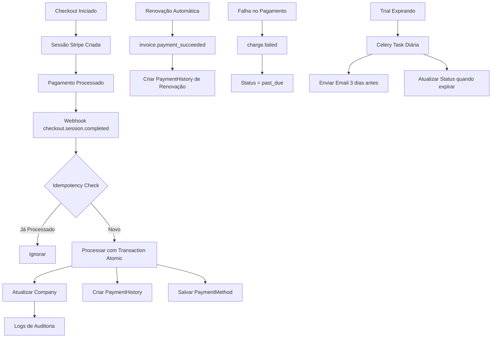

# 🚀 Melhorias Implementadas no Sistema de Pagamentos

## ✅ Correções Implementadas

### 1. **Novos Handlers de Webhook Adicionados**
Implementados no `payment_service.py`:

- ✅ `invoice.payment_succeeded` - Registra renovações automáticas no histórico
- ✅ `payment_method.attached` - Salva cartões quando anexados ao cliente
- ✅ `charge.failed` - Atualiza status para `past_due` em falhas
- ✅ `customer.subscription.trial_will_end` - Envia email 3 dias antes do trial expirar

### 2. **Idempotency Check para Webhooks**
```python
# Evita processar o mesmo evento múltiplas vezes
cache_key = f"webhook_processed:{event_type}:{event_id}"
if cache.get(cache_key):
    return  # Já processado
cache.set(cache_key, True, 86400)  # 24 horas
```

### 3. **Cancelamento Integrado com Stripe**
```python
def cancel_subscription(self, subscription_id: str, immediately: bool = False)
```
- Cancela no final do período ou imediatamente
- Atualiza status local após sucesso no Stripe
- Suporta Stripe e MercadoPago

### 4. **Rate Limiting Implementado**
No middleware (`companies/middleware.py`):
- 10 requisições de AI por minuto por usuário
- Retorna erro 429 quando excede limite
- Cache com TTL de 60 segundos

### 5. **Trial Check Movido para Celery**
- Task `check_trial_expirations` roda diariamente às 9h
- Middleware não atualiza mais status (evita race conditions)
- Envia emails de notificação automaticamente

### 6. **Cálculo de Proration**
```python
def calculate_proration(self, company, new_plan, billing_cycle='monthly')
```
- Calcula crédito por tempo não usado
- Calcula cobrança proporcional do novo plano
- Retorna valor líquido a cobrar/creditar

### 7. **Salvamento de Métodos de Pagamento Corrigido**
- Busca sessão expandida do Stripe para obter detalhes do cartão
- Handler `payment_method.attached` salva automaticamente
- Evita duplicatas verificando `stripe_payment_method_id`

### 8. **Logs Detalhados para Auditoria**
Exemplo de log melhorado:
```
==================================================
CHECKOUT COMPLETED - Session ID: cs_test_xxx
Customer: cus_xxx
Amount: 149.90 BRL
Payment Status: paid
Metadata: {'company_id': '1', 'plan_id': '3'}
==================================================
SUBSCRIPTION ACTIVATED:
  Company: Empresa XYZ (ID: 1)
  Plan: Empresarial (monthly)
  Status: active
  Subscription ID: sub_xxx
  Next Billing: 2025-02-21
```

## 📊 Fluxo de Pagamento Atualizado



## 🔒 Melhorias de Segurança

1. **Transações Atômicas**: Todos os webhooks usam `transaction.atomic()`
2. **Validação de Metadata**: Verifica campos obrigatórios
3. **Rate Limiting**: Previne abuso de API
4. **Idempotency**: Evita duplicação de pagamentos
5. **Logs Detalhados**: Facilita auditoria e debugging

## 🎯 Problemas Resolvidos

- ✅ Renovações aparecem no histórico
- ✅ Cartões são salvos corretamente
- ✅ Cancelamento funciona no Stripe
- ✅ Trials não causam mais race conditions
- ✅ Rate limiting previne abuso
- ✅ Webhooks não são processados em duplicata
- ✅ Logs facilitam troubleshooting

## ⚡ Performance

- Trial check movido para background (Celery)
- Cache para idempotency (Redis)
- Rate limiting em memória
- Transações atômicas para consistência

## 🔄 Próximos Passos Recomendados

1. **Monitoramento**: Configurar alertas para falhas de pagamento
2. **Dashboard Admin**: Criar visualização de métricas de pagamento
3. **Retry Logic**: Implementar retry automático para webhooks falhos
4. **Testes**: Adicionar testes unitários para novos handlers