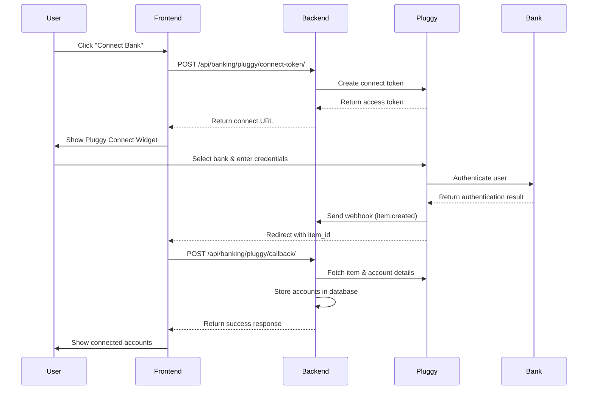
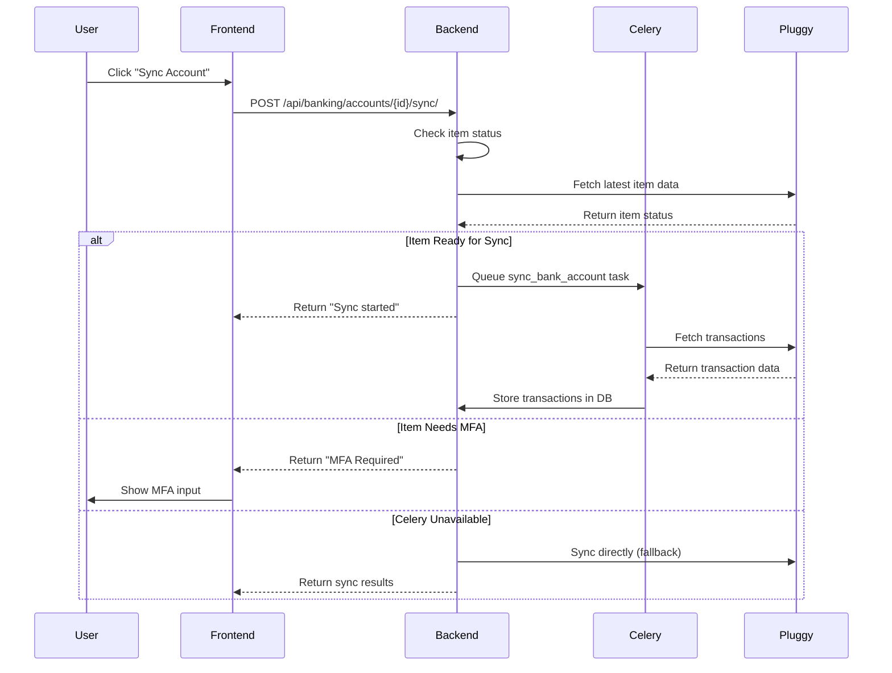
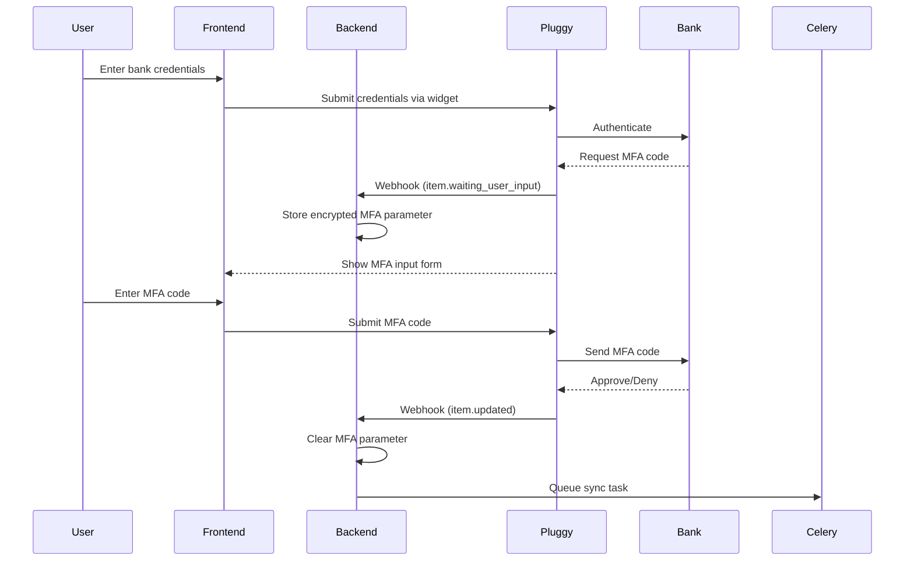

# Finance Hub - Pluggy Banking Integration Documentation

## Table of Contents

1. [Architecture Overview](#architecture-overview)
2. [User Flow](#user-flow)
3. [Technical Implementation](#technical-implementation)
4. [Security & Authentication](#security--authentication)
5. [Error Handling](#error-handling)
6. [Development Setup](#development-setup)
7. [API Endpoints](#api-endpoints)
8. [Webhook System](#webhook-system)
9. [Testing & Debugging](#testing--debugging)

---

## Architecture Overview

The Finance Hub integrates with Pluggy's Open Banking API to provide secure bank account connections and financial data synchronization. The architecture follows a microservices pattern with clear separation of concerns.

### System Architecture

```
┌─────────────────┐    ┌─────────────────┐    ┌─────────────────┐
│   Frontend      │    │    Backend      │    │   Pluggy API    │
│   (Next.js)     │    │   (Django)      │    │   (External)    │
├─────────────────┤    ├─────────────────┤    ├─────────────────┤
│ • React UI      │◄──►│ • REST API      │◄──►│ • Bank Data     │
│ • Pluggy Widget │    │ • Webhook Handler│    │ • Connectors    │
│ • State Mgmt    │    │ • Celery Tasks  │    │ • Transactions  │
│ • TypeScript    │    │ • Data Models   │    │ • Categories    │
└─────────────────┘    └─────────────────┘    └─────────────────┘
                                │
                       ┌─────────────────┐
                       │   Background    │
                       │   Processing    │
                       ├─────────────────┤
                       │ • Redis Queue   │
                       │ • Celery Worker │
                       │ • Sync Tasks    │
                       └─────────────────┘
```

### Core Components

#### Backend (Django)
- **Models**: Data structures following Pluggy API schema
- **Views**: REST API endpoints for frontend communication
- **Tasks**: Async processing with Celery for data synchronization
- **Client**: Pluggy API client with authentication and error handling
- **Webhooks**: Real-time event processing from Pluggy

#### Frontend (Next.js)
- **Pages**: User interface for account management
- **Services**: API communication layer
- **Store**: State management with Zustand
- **Types**: TypeScript definitions matching backend models

#### Key Models

1. **PluggyConnector**: Represents bank institutions (Itau, Bradesco, etc.)
2. **PluggyItem**: User's connection to a specific bank
3. **BankAccount**: Individual bank accounts (checking, savings, credit)
4. **Transaction**: Financial transactions from bank statements
5. **TransactionCategory**: Classification system for transactions

---

## User Flow

### 1. Bank Connection Flow



### 2. Transaction Synchronization Flow



### 3. MFA (Multi-Factor Authentication) Flow



---

## Technical Implementation

### Data Models

#### PluggyConnector Model
```python
class PluggyConnector(models.Model):
    """Represents bank institutions available through Pluggy"""
    pluggy_id = models.IntegerField(unique=True, db_index=True)
    name = models.CharField(max_length=200)  # "Itaú", "Bradesco", etc.
    institution_url = models.URLField(blank=True)
    image_url = models.URLField(blank=True)  # Bank logo
    primary_color = models.CharField(max_length=7, default='#000000')
    
    # Classification
    type = models.CharField(max_length=50)  # PERSONAL_BANK, BUSINESS_BANK
    country = models.CharField(max_length=2, default='BR')
    
    # Features
    has_mfa = models.BooleanField(default=False)
    has_oauth = models.BooleanField(default=False)
    is_open_finance = models.BooleanField(default=False)
    is_sandbox = models.BooleanField(default=False)
    
    # Supported features
    products = models.JSONField(default=list)  # ['ACCOUNTS', 'TRANSACTIONS']
    credentials = models.JSONField(default=list)  # Required credential fields
```

#### PluggyItem Model
```python
class PluggyItem(models.Model):
    """User's connection to a specific bank through Pluggy"""
    pluggy_item_id = models.CharField(max_length=100, unique=True)
    company = models.ForeignKey('companies.Company', on_delete=models.CASCADE)
    connector = models.ForeignKey(PluggyConnector, on_delete=models.PROTECT)
    
    # Status tracking
    status = models.CharField(max_length=30, choices=ITEM_STATUS_CHOICES)
    execution_status = models.CharField(max_length=50, choices=EXECUTION_STATUS_CHOICES)
    
    # MFA handling (encrypted)
    encrypted_parameter = models.TextField(blank=True, default='')
    
    # Error tracking
    error_code = models.CharField(max_length=50, blank=True)
    error_message = models.TextField(blank=True)
    status_detail = models.JSONField(default=dict, blank=True)
    
    def get_mfa_parameter(self):
        """Decrypt and return MFA parameter"""
        from apps.banking.utils.encryption import banking_encryption
        if self.encrypted_parameter:
            return banking_encryption.decrypt_mfa_parameter(self.encrypted_parameter)
        return self.parameter  # Fallback for backward compatibility
    
    def set_mfa_parameter(self, parameter_data):
        """Encrypt and store MFA parameter"""
        from apps.banking.utils.encryption import banking_encryption
        if parameter_data:
            self.encrypted_parameter = banking_encryption.encrypt_mfa_parameter(parameter_data)
            self.parameter = {}  # Clear unencrypted field
```

#### BankAccount Model
```python
class BankAccount(models.Model):
    """Individual bank account (checking, savings, credit card)"""
    pluggy_account_id = models.CharField(max_length=100, unique=True)
    item = models.ForeignKey(PluggyItem, on_delete=models.CASCADE)
    company = models.ForeignKey('companies.Company', on_delete=models.CASCADE)
    
    # Account information
    type = models.CharField(max_length=20, choices=ACCOUNT_TYPE_CHOICES)
    subtype = models.CharField(max_length=30, choices=ACCOUNT_SUBTYPE_CHOICES)
    name = models.CharField(max_length=200, blank=True)
    number = models.CharField(max_length=50, blank=True)
    
    # Balance information
    balance = models.DecimalField(max_digits=15, decimal_places=2)
    currency_code = models.CharField(max_length=3, default='BRL')
    balance_date = models.DateTimeField(blank=True, null=True)
    
    # Type-specific data
    bank_data = models.JSONField(default=dict, blank=True)      # For BANK accounts
    credit_data = models.JSONField(default=dict, blank=True)    # For CREDIT accounts
    
    @property
    def display_name(self):
        """User-friendly account name"""
        if self.name:
            return self.name
        elif self.marketing_name:
            return self.marketing_name
        else:
            return f"{self.item.connector.name} - {self.masked_number}"
```

#### Transaction Model
```python
class Transaction(models.Model):
    """Financial transaction from bank statement"""
    pluggy_transaction_id = models.CharField(max_length=100, unique=True)
    account = models.ForeignKey(BankAccount, on_delete=models.CASCADE)
    company = models.ForeignKey('companies.Company', on_delete=models.CASCADE)
    
    # Transaction details
    type = models.CharField(max_length=10, choices=TRANSACTION_TYPE_CHOICES)  # DEBIT/CREDIT
    status = models.CharField(max_length=10, choices=TRANSACTION_STATUS_CHOICES)  # PENDING/POSTED
    description = models.CharField(max_length=500)
    amount = models.DecimalField(max_digits=15, decimal_places=2)
    date = models.DateTimeField()
    
    # Categorization
    pluggy_category_id = models.CharField(max_length=100, blank=True)
    pluggy_category_description = models.CharField(max_length=200, blank=True)
    category = models.ForeignKey('TransactionCategory', on_delete=models.SET_NULL, null=True)
    
    # Additional data
    merchant = models.JSONField(default=dict, blank=True)
    payment_data = models.JSONField(default=dict, blank=True)  # Open Finance
    credit_card_metadata = models.JSONField(default=dict, blank=True)
    
    @classmethod
    def create_safe(cls, company, **transaction_data):
        """Create transaction with plan limit verification"""
        with db_transaction.atomic():
            success, message = company.increment_usage_safe('transactions')
            if not success:
                raise PermissionDenied({
                    'error': 'Transaction limit reached',
                    'message': message,
                    'upgrade_required': True
                })
            
            return cls.objects.create(company=company, **transaction_data)
```

### API Client Implementation

#### PluggyClient Class
```python
class PluggyClient:
    """Client for Pluggy API communication with authentication and error handling"""
    
    def __init__(self):
        self.client_id = settings.PLUGGY_CLIENT_ID
        self.client_secret = settings.PLUGGY_CLIENT_SECRET
        self.base_url = settings.PLUGGY_BASE_URL
        self.timeout = getattr(settings, 'PLUGGY_API_TIMEOUT', 30)
        self.api_key = None
    
    def _get_api_key(self) -> str:
        """Get or refresh API key with caching"""
        cache_key = f'pluggy_api_key_{self.client_id}'
        api_key = cache.get(cache_key)
        
        if api_key:
            return api_key
            
        # Authenticate with Pluggy
        response = requests.post(f"{self.base_url}/auth", json={
            "clientId": self.client_id,
            "clientSecret": self.client_secret
        }, timeout=self.timeout)
        
        response.raise_for_status()
        data = response.json()
        api_key = data['apiKey']
        
        # Cache for 110 minutes (tokens expire in 2 hours)
        cache.set(cache_key, api_key, 6600)
        return api_key
    
    def create_connect_token(self, client_user_id: str, **options) -> Dict[str, Any]:
        """Create connect token for Pluggy Connect widget"""
        payload = {"clientUserId": client_user_id}
        payload.update(options)
        return self._make_request("POST", "connect_token", data=payload)
    
    def get_item(self, item_id: str) -> Dict[str, Any]:
        """Get item details with current status"""
        return self._make_request('GET', f'items/{item_id}')
    
    def get_transactions(self, account_id: str, **filters) -> Dict[str, Any]:
        """Get transactions for an account with pagination"""
        params = {'accountId': account_id, **filters}
        return self._make_request('GET', 'transactions', params=params)
```

### Async Task Processing

#### Celery Tasks
```python
@shared_task(bind=True, max_retries=5, default_retry_delay=60)
def sync_bank_account(self, item_id: str, account_id: Optional[str] = None, force_update: bool = False):
    """Async task for syncing bank account data"""
    try:
        item = PluggyItem.objects.get(id=item_id)
        
        with PluggyClient() as client:
            # Check item status
            item_data = client.get_item(item.pluggy_item_id)
            item.status = item_data['status']
            item.execution_status = item_data.get('executionStatus', '')
            item.save()
            
            # Handle different statuses
            if item.status == 'WAITING_USER_INPUT':
                return {'success': False, 'reason': 'MFA required'}
            
            if item.status in ['LOGIN_ERROR', 'INVALID_CREDENTIALS']:
                return {'success': False, 'requires_reconnection': True}
            
            # Sync accounts and transactions
            return _sync_account(client, item)
            
    except PluggyError as e:
        # Implement retry logic based on error type
        if 'RATE_LIMIT' in str(e):
            raise self.retry(exc=e, countdown=300)
        elif 'TIMEOUT' in str(e):
            raise self.retry(exc=e, countdown=60 * (2 ** self.request.retries))
        else:
            logger.error(f"Pluggy API error: {e}")
            return {'success': False, 'error': str(e)}

def _sync_account(client: PluggyClient, item: PluggyItem) -> Dict:
    """Sync account data and transactions"""
    accounts = BankAccount.objects.filter(item=item, is_active=True)
    sync_stats = {'transactions_synced': 0, 'accounts_synced': 0}
    
    for account in accounts:
        # Fetch transactions with pagination
        page = 1
        while True:
            response = client.get_transactions(
                account.pluggy_account_id,
                page=page,
                pageSize=500
            )
            
            transactions = response.get('results', [])
            if not transactions:
                break
                
            # Process transactions
            for tx_data in transactions:
                _create_or_update_transaction(account, tx_data)
                sync_stats['transactions_synced'] += 1
            
            # Check if there are more pages
            if not response.get('hasNext', False):
                break
            page += 1  # Critical: increment page to avoid infinite loop
        
        sync_stats['accounts_synced'] += 1
    
    return {'success': True, 'sync_stats': sync_stats}
```

### Frontend Integration

#### React Hook for Banking Operations
```typescript
// Custom hook for banking operations
export function useBanking() {
  const [accounts, setAccounts] = useState<BankAccount[]>([]);
  const [loading, setLoading] = useState(false);
  
  const connectBank = async () => {
    try {
      setLoading(true);
      
      // Get connect token
      const response = await bankingService.createConnectToken();
      if (!response.success) {
        throw new Error(response.error);
      }
      
      // Initialize Pluggy Connect widget
      return new Promise<void>((resolve, reject) => {
        const pluggy = new PluggyConnect({
          connectToken: response.data.connect_token,
          onSuccess: async (itemData) => {
            // Handle successful connection
            await handleConnectCallback(itemData.item.id);
            resolve();
          },
          onError: (error) => {
            reject(new Error(error.message));
          }
        });
        
        pluggy.init();
      });
    } finally {
      setLoading(false);
    }
  };
  
  const syncAccount = async (accountId: string) => {
    const response = await bankingService.syncAccount(accountId);
    if (!response.success) {
      throw new Error(response.error || 'Sync failed');
    }
    return response;
  };
  
  return {
    accounts,
    loading,
    connectBank,
    syncAccount,
    refreshAccounts: fetchAccounts
  };
}
```

---

## Security & Authentication

### MFA Parameter Encryption

The system implements strong encryption for sensitive MFA parameters:

```python
class BankingEncryption:
    """Encryption service for banking sensitive data"""
    
    def __init__(self):
        self.encryption_service = EncryptionService()
    
    def encrypt_mfa_parameter(self, parameter: Dict) -> str:
        """Encrypt MFA parameter using Fernet encryption"""
        return self.encryption_service.encrypt_value(parameter)
    
    def decrypt_mfa_parameter(self, encrypted_parameter: str) -> Dict:
        """Decrypt MFA parameter"""
        return self.encryption_service.decrypt_value(encrypted_parameter)

# Usage in PluggyItem model
def set_mfa_parameter(self, parameter_data):
    """Store encrypted MFA parameter"""
    if parameter_data:
        self.encrypted_parameter = banking_encryption.encrypt_mfa_parameter(parameter_data)
        self.parameter = {}  # Clear unencrypted field for security
```

### Webhook Security

Webhook endpoints validate signatures to ensure authenticity:

```python
def validate_webhook_signature(self, signature: str, payload: bytes) -> bool:
    """Validate webhook signature using HMAC-SHA256"""
    webhook_secret = settings.PLUGGY_WEBHOOK_SECRET
    
    expected_signature = hmac.new(
        webhook_secret.encode('utf-8'),
        payload,
        hashlib.sha256
    ).hexdigest()
    
    return hmac.compare_digest(signature.lower(), expected_signature.lower())
```

### Plan Limits & Usage Tracking

The system enforces subscription plan limits safely:

```python
def increment_usage_safe(self, usage_type: str) -> Tuple[bool, str]:
    """Safely increment usage counter with atomic transaction"""
    with transaction.atomic():
        # Get current usage with row-level lock
        usage, created = ResourceUsage.objects.select_for_update().get_or_create(
            company=self,
            usage_type=usage_type,
            defaults={'current_usage': 0}
        )
        
        # Check limit
        plan_limit = self.subscription_plan.get_limit(usage_type)
        if usage.current_usage >= plan_limit:
            return False, f"Limit reached: {usage.current_usage}/{plan_limit}"
        
        # Increment safely
        usage.current_usage += 1
        usage.save()
        return True, "Usage incremented"
```

---

## Error Handling

### Error Types & Recovery Strategies

#### 1. Authentication Errors
```python
# In sync task
if item.status in ['LOGIN_ERROR', 'INVALID_CREDENTIALS']:
    return {
        'success': False,
        'reason': f'Invalid credentials: {item.status}',
        'requires_reconnection': True,
        'error_code': item.error_code
    }
```

#### 2. MFA Timeout Errors
```python
# Check for USER_INPUT_TIMEOUT
if item.execution_status == 'USER_INPUT_TIMEOUT':
    return {
        'success': False,
        'error_code': 'AUTHENTICATION_TIMEOUT',
        'message': 'Authentication timeout. Please reconnect your account.',
        'reconnection_required': True
    }
```

#### 3. Network & Rate Limit Errors
```python
# In Celery task with retry logic
except PluggyError as e:
    if 'RATE_LIMIT' in str(e):
        raise self.retry(exc=e, countdown=300)  # 5 minute backoff
    elif 'TIMEOUT' in str(e):
        raise self.retry(exc=e, countdown=60 * (2 ** self.request.retries))
    else:
        logger.error(f"Permanent API error: {e}")
        return {'success': False, 'error': str(e)}
```

#### 4. Database Errors
```python
# Idempotent transaction creation
try:
    transaction = Transaction.objects.create(**transaction_data)
except IntegrityError:
    # Transaction already exists (duplicate pluggy_transaction_id)
    transaction = Transaction.objects.get(
        pluggy_transaction_id=transaction_data['pluggy_transaction_id']
    )
    # Update if needed
    for key, value in transaction_data.items():
        setattr(transaction, key, value)
    transaction.save()
```

#### 5. Celery/Redis Connection Issues
```python
# Graceful fallback when Celery is unavailable
def sync_account_with_fallback(account_id: str):
    try:
        # Try async processing
        task = sync_bank_account.delay(str(account_id))
        return {'success': True, 'task_id': task.id, 'mode': 'async'}
    except Exception as celery_error:
        logger.warning(f"Celery unavailable: {celery_error}")
        
        # Fall back to synchronous processing
        try:
            from apps.banking.tasks import _sync_account
            with PluggyClient() as client:
                result = _sync_account(client, account)
                return {'success': True, 'result': result, 'mode': 'sync'}
        except Exception as sync_error:
            return {
                'success': False,
                'error': 'Sync service temporarily unavailable',
                'details': str(sync_error)
            }
```

---

## Development Setup

### Environment Configuration

#### Backend Settings (development.py)
```python
# Pluggy API Configuration
PLUGGY_BASE_URL = config('PLUGGY_BASE_URL', default='https://api.pluggy.ai')
PLUGGY_CLIENT_ID = config('PLUGGY_CLIENT_ID', default='')
PLUGGY_CLIENT_SECRET = config('PLUGGY_CLIENT_SECRET', default='')
PLUGGY_USE_SANDBOX = config('PLUGGY_USE_SANDBOX', default=True, cast=bool)
PLUGGY_CONNECT_URL = config('PLUGGY_CONNECT_URL', default='https://connect.pluggy.ai')

# Webhook Configuration
PLUGGY_WEBHOOK_SECRET = config('PLUGGY_WEBHOOK_SECRET', default='')
PLUGGY_WEBHOOK_URL = config('PLUGGY_WEBHOOK_URL', 
    default='http://localhost:8000/api/banking/webhooks/pluggy/')

# Optional: API timeout configuration
PLUGGY_API_TIMEOUT = config('PLUGGY_API_TIMEOUT', default=30, cast=int)
```

#### Environment Variables (.env)
```bash
# Pluggy API Credentials (get from Pluggy Dashboard)
PLUGGY_CLIENT_ID=your_client_id
PLUGGY_CLIENT_SECRET=your_client_secret
PLUGGY_USE_SANDBOX=True

# For receiving webhooks in development
PLUGGY_WEBHOOK_SECRET=your_webhook_secret
PLUGGY_WEBHOOK_URL=https://your-ngrok-url.ngrok.io/api/banking/webhooks/pluggy/

# Optional Redis/Celery (for async processing)
REDIS_URL=redis://localhost:6379/0
```

### Local Development Setup

#### 1. Backend Setup
```bash
# Install dependencies
cd backend
pip install -r requirements.txt

# Run migrations
python manage.py migrate

# Sync Pluggy connectors (banks)
python manage.py shell
>>> from apps.banking.models import PluggyConnector
>>> from apps.banking.integrations.pluggy.client import PluggyClient
>>> with PluggyClient() as client:
...     connectors = client.get_connectors()
...     for conn_data in connectors:
...         PluggyConnector.objects.update_or_create(
...             pluggy_id=conn_data['id'],
...             defaults={**conn_data}
...         )

# Start development server
python manage.py runserver
```

#### 2. Frontend Setup
```bash
# Install dependencies
cd frontend
npm install

# Start development server
npm run dev
```

#### 3. Optional: Redis & Celery (for async processing)
```bash
# Start Redis server
redis-server

# Start Celery worker
cd backend
celery -A core worker -l info

# Optional: Start Celery beat (for scheduled tasks)
celery -A core beat -l info
```

#### 4. Webhook Development with ngrok
```bash
# Install ngrok
brew install ngrok  # macOS
# or download from https://ngrok.com

# Expose local server
ngrok http 8000

# Update your .env file with the ngrok URL
PLUGGY_WEBHOOK_URL=https://abc123.ngrok.io/api/banking/webhooks/pluggy/

# Configure this URL in your Pluggy Dashboard
```

### Testing Bank Connections

#### 1. Using Sandbox Mode
```python
# In development.py, ensure sandbox is enabled
PLUGGY_USE_SANDBOX = True

# Available sandbox connectors
SANDBOX_BANKS = [
    {"name": "Sandbox Bank", "id": 201},
    {"name": "Sandbox Credit Union", "id": 202}
]

# Sandbox credentials (any values work)
SANDBOX_CREDENTIALS = {
    "user": "test_user",
    "password": "test_password"
}
```

#### 2. Manual Testing Flow
```bash
# 1. Connect a bank account
curl -X POST http://localhost:8000/api/banking/pluggy/connect-token/ \
  -H "Authorization: Bearer YOUR_JWT_TOKEN" \
  -H "Content-Type: application/json"

# 2. Check item status
curl http://localhost:8000/api/banking/items/ \
  -H "Authorization: Bearer YOUR_JWT_TOKEN"

# 3. Sync transactions
curl -X POST http://localhost:8000/api/banking/accounts/{account-id}/sync/ \
  -H "Authorization: Bearer YOUR_JWT_TOKEN"

# 4. View transactions
curl http://localhost:8000/api/banking/transactions/ \
  -H "Authorization: Bearer YOUR_JWT_TOKEN"
```

---

## API Endpoints

### Authentication
All endpoints require JWT authentication via `Authorization: Bearer <token>` header.

### Core Banking Endpoints

#### Connectors (Banks)
```http
GET /api/banking/connectors/
# Get available banks
# Query params: type, is_open_finance, country

POST /api/banking/connectors/sync/
# Sync connector list from Pluggy API
```

#### Connection Management
```http
POST /api/banking/pluggy/connect-token/
# Create connect token for Pluggy widget
Body: {
  "client_user_id": "optional",
  "webhook_url": "optional"
}
Response: {
  "success": true,
  "data": {
    "connect_token": "token_string",
    "connect_url": "https://connect.pluggy.ai"
  }
}

POST /api/banking/pluggy/callback/
# Handle successful connection callback
Body: {
  "item_id": "pluggy_item_id"
}
Response: {
  "success": true,
  "data": {
    "item": {...},
    "accounts": [...],
    "sync_scheduled": true
  }
}
```

#### Items (Bank Connections)
```http
GET /api/banking/items/
# List user's bank connections

GET /api/banking/items/{id}/
# Get specific connection details

POST /api/banking/items/{id}/sync/
# Trigger manual sync for all accounts in item

DELETE /api/banking/items/{id}/
# Delete connection (removes from Pluggy)
```

#### Bank Accounts
```http
GET /api/banking/accounts/
# List user's bank accounts
# Query params: type, is_active

GET /api/banking/accounts/{id}/
# Get account details

POST /api/banking/accounts/{id}/sync/
# Sync specific account
Body: {
  "force": false,
  "from_date": "2024-01-01",
  "to_date": "2024-12-31"
}
Response: {
  "success": true,
  "data": {
    "sync_stats": {
      "transactions_synced": 150,
      "sync_from": "2024-01-01T00:00:00Z",
      "sync_to": "2024-12-31T23:59:59Z"
    }
  }
}
```

#### Transactions
```http
GET /api/banking/transactions/
# List transactions with filtering and pagination
# Query params: account_id, category_id, start_date, end_date, 
#               min_amount, max_amount, type, status, search

GET /api/banking/transactions/{id}/
# Get transaction details

PATCH /api/banking/transactions/{id}/
# Update transaction (notes, category)
Body: {
  "notes": "Updated notes",
  "category": "category_id"
}

POST /api/banking/transactions/bulk-categorize/
# Bulk categorization
Body: {
  "transaction_ids": ["id1", "id2"],
  "category_id": "category_id"
}
```

#### Categories
```http
GET /api/banking/categories/
# List transaction categories

POST /api/banking/categories/
# Create custom category
Body: {
  "name": "Category Name",
  "type": "expense",
  "parent": "parent_id",
  "icon": "🏪",
  "color": "#FF5733"
}
```

#### Dashboard
```http
GET /api/banking/dashboard/
# Get dashboard data
Response: {
  "total_balance": 15000.50,
  "total_accounts": 3,
  "current_month": {
    "income": 8000.00,
    "expenses": 3500.00,
    "net": 4500.00
  },
  "recent_transactions": [...],
  "category_breakdown": [...],
  "accounts_summary": [...]
}
```

### Webhook Endpoints
```http
POST /api/banking/webhooks/pluggy/
# Receive Pluggy webhook events
# Validates signature and processes asynchronously
Headers: X-Pluggy-Signature: signature_hash
```

---

## Webhook System

### Webhook Events Handled

The system processes various Pluggy webhook events:

#### Item Events
- **item.created**: New bank connection established
- **item.updated**: Connection data updated successfully  
- **item.error**: Connection encountered an error
- **item.waiting_user_input**: MFA or additional authentication required
- **item.deleted**: Connection was deleted

#### Transaction Events
- **transactions.created**: New transactions available
- **transactions.updated**: Existing transactions modified
- **transactions.deleted**: Transactions were removed

#### Implementation
```python
@csrf_exempt
@require_http_methods(["POST"])
def pluggy_webhook(request):
    """Process Pluggy webhook events"""
    try:
        payload = request.body.decode('utf-8')
        data = json.loads(payload)
        
        # Validate signature
        signature = request.headers.get('X-Pluggy-Signature', '')
        client = PluggyClient()
        if not client.validate_webhook(signature, payload):
            return JsonResponse({"error": "Invalid signature"}, status=401)
        
        # Extract event data
        event_type = data.get('event')
        event_id = data.get('eventId')
        item_id = data.get('itemId')
        
        # Store webhook for audit
        item = PluggyItem.objects.get(pluggy_item_id=item_id)
        webhook, created = ItemWebhook.objects.get_or_create(
            event_id=event_id,
            defaults={
                'item': item,
                'event_type': event_type,
                'payload': data,
                'triggered_by': data.get('triggeredBy', 'CLIENT')
            }
        )
        
        # Process asynchronously
        process_webhook_event.delay(event_type, data)
        
        # Return immediate response (required by Pluggy)
        return JsonResponse({"status": "accepted"}, status=200)
        
    except Exception as e:
        logger.error(f"Webhook processing error: {e}")
        return JsonResponse({"error": "Internal error"}, status=500)

@shared_task
def process_webhook_event(event_type: str, data: dict):
    """Process webhook event asynchronously"""
    item_id = data.get('itemId')
    
    if event_type in ['item.updated', 'transactions.created']:
        # Trigger data sync
        sync_bank_account.delay(item_id)
    
    elif event_type == 'item.waiting_user_input':
        # Store MFA parameter
        item = PluggyItem.objects.get(pluggy_item_id=item_id)
        mfa_data = data.get('data', {}).get('parameter', {})
        item.set_mfa_parameter(mfa_data)
        item.save()
    
    elif event_type == 'item.error':
        # Update error status
        item = PluggyItem.objects.get(pluggy_item_id=item_id)
        error_info = data.get('data', {}).get('error', {})
        item.error_code = error_info.get('code', '')
        item.error_message = error_info.get('message', '')
        item.save()
```

### Webhook Security

#### Signature Validation
```python
def validate_webhook_signature(self, signature: str, payload: bytes) -> bool:
    """Validate webhook signature using HMAC-SHA256"""
    webhook_secret = settings.PLUGGY_WEBHOOK_SECRET
    
    expected_signature = hmac.new(
        webhook_secret.encode('utf-8'),
        payload,
        hashlib.sha256
    ).hexdigest()
    
    return hmac.compare_digest(signature.lower(), expected_signature.lower())
```

#### Event Idempotency
```python
# Prevent duplicate webhook processing
webhook, created = ItemWebhook.objects.get_or_create(
    event_id=event_id,
    defaults={
        'item': item,
        'event_type': event_type,
        'payload': data
    }
)

if not created:
    logger.info(f"Duplicate webhook event {event_id} - ignoring")
    return JsonResponse({"status": "duplicate"}, status=200)
```

---

## Testing & Debugging

### Common Issues & Solutions

#### 1. Webhook Not Received in Development
**Problem**: Local development server doesn't receive webhooks
**Solution**: Use ngrok to expose localhost
```bash
# Start ngrok
ngrok http 8000

# Update webhook URL in Pluggy Dashboard
https://abc123.ngrok.io/api/banking/webhooks/pluggy/

# Update environment variable
PLUGGY_WEBHOOK_URL=https://abc123.ngrok.io/api/banking/webhooks/pluggy/
```

#### 2. MFA Timeout Issues
**Problem**: `USER_INPUT_TIMEOUT` after MFA prompt
**Solution**: Implement proper status checking
```python
# Check item status before sync
item_data = client.get_item(item.pluggy_item_id)
if item_data.get('executionStatus') == 'USER_INPUT_TIMEOUT':
    return {
        'success': False,
        'error_code': 'AUTHENTICATION_TIMEOUT',
        'reconnection_required': True
    }
```

#### 3. Transaction Sync Not Working
**Problem**: Sync appears successful but no transactions saved
**Solution**: Check transaction creation limits and database errors
```python
# Enable detailed logging
import logging
logging.getLogger('apps.banking').setLevel(logging.DEBUG)

# Check plan limits
company = request.user.company
if company.current_month_transactions >= company.subscription_plan.max_transactions:
    # Upgrade required
    pass
```

#### 4. Celery Tasks Not Running
**Problem**: Async processing doesn't work
**Solution**: Implement synchronous fallback
```python
def sync_with_fallback(account_id):
    try:
        # Try async
        task = sync_bank_account.delay(account_id)
        return {'mode': 'async', 'task_id': task.id}
    except Exception:
        # Fall back to sync
        result = sync_bank_account.apply(args=[account_id])
        return {'mode': 'sync', 'result': result.get()}
```

### Debug Commands

#### Check Item Status
```python
# Django shell
python manage.py shell

from apps.banking.models import PluggyItem
from apps.banking.integrations.pluggy.client import PluggyClient

item = PluggyItem.objects.get(pluggy_item_id='your_item_id')
with PluggyClient() as client:
    status = client.get_item(item.pluggy_item_id)
    print(f"Status: {status['status']}")
    print(f"Execution Status: {status.get('executionStatus')}")
    print(f"Error: {status.get('error')}")
```

#### Manual Transaction Sync
```python
# Force sync all accounts for a company
from apps.banking.tasks import sync_bank_account
from apps.banking.models import PluggyItem

company_id = 'your_company_id'
items = PluggyItem.objects.filter(company_id=company_id)

for item in items:
    print(f"Syncing item {item.pluggy_item_id}...")
    result = sync_bank_account.apply(args=[str(item.id)], kwargs={'force_update': True})
    print(f"Result: {result.get()}")
```

#### Check Webhook Events
```python
# View recent webhooks
from apps.banking.models import ItemWebhook

webhooks = ItemWebhook.objects.filter(
    item__company_id='your_company_id'
).order_by('-created_at')[:10]

for webhook in webhooks:
    print(f"{webhook.event_type} - {webhook.processed} - {webhook.created_at}")
    if webhook.error:
        print(f"Error: {webhook.error}")
```

### Monitoring & Logging

#### Key Metrics to Monitor
- Item status distribution
- Sync success/failure rates  
- Transaction processing volume
- MFA timeout frequency
- Webhook processing latency

#### Log Analysis Examples
```bash
# Check for sync errors
grep "sync_bank_account" backend/logs/django.log | grep ERROR

# Monitor webhook processing
grep "webhook" backend/logs/django.log | grep -E "(received|processed|error)"

# Check API rate limits
grep "RATE_LIMIT" backend/logs/django.log

# Monitor MFA events
grep "MFA" backend/logs/django.log
```

---

This documentation provides a comprehensive overview of the Finance Hub's Pluggy banking integration. The system is designed with security, reliability, and scalability in mind, featuring robust error handling, encryption of sensitive data, and graceful fallback mechanisms for various failure scenarios.

For additional support or questions about implementing features, refer to the Pluggy API documentation at https://docs.pluggy.ai/ and the codebase examples provided above.