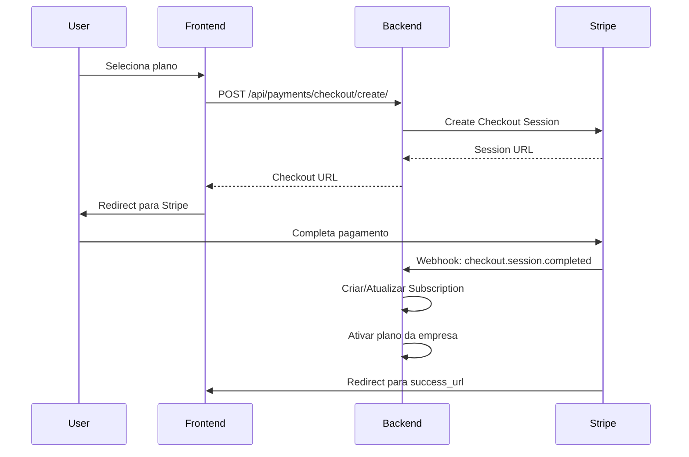
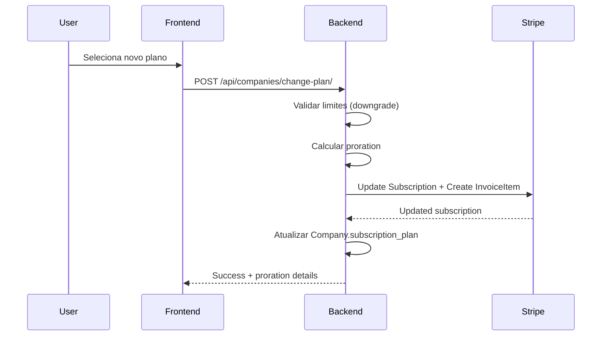
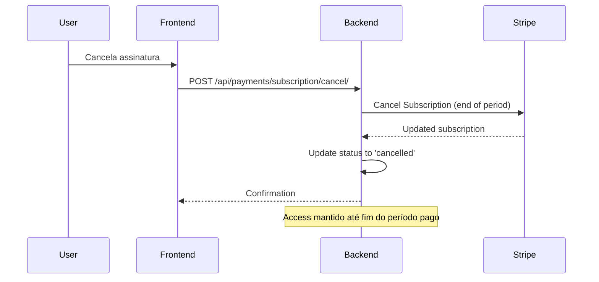

# Sistema de Planos, Assinaturas e Pagamentos (Stripe) - Finance Hub

## Visão Geral

O Finance Hub implementa um sistema completo de assinaturas e pagamentos integrado com o Stripe. Este documento detalha como o sistema funciona, sua arquitetura e como implementar novas funcionalidades.

---

## 📋 Tabela de Conteúdo

1. [Arquitetura Geral](#arquitetura-geral)
2. [Modelos de Dados](#modelos-de-dados)
3. [Fluxos de Pagamento](#fluxos-de-pagamento)
4. [Integração com Stripe](#integração-com-stripe)
5. [Frontend e Interface](#frontend-e-interface)
6. [Como Implementar Novas Features](#como-implementar-novas-features)
7. [Webhooks e Eventos](#webhooks-e-eventos)
8. [Monitoramento e Logs](#monitoramento-e-logs)

---

## 🏗️ Arquitetura Geral

### Estrutura do Sistema

```
backend/
├── apps/companies/
│   ├── models.py          # Company, SubscriptionPlan, ResourceUsage
│   └── ...
├── apps/payments/
│   ├── models.py          # Subscription, Payment, PaymentMethod, etc.
│   ├── services/
│   │   ├── stripe_service.py       # Integração principal com Stripe
│   │   ├── subscription_service.py # Lógica de mudança de planos
│   │   ├── webhook_handler.py      # Processamento de webhooks
│   │   └── ...
│   └── ...

frontend/
├── services/
│   └── unified-subscription.service.ts  # Cliente API unificado
├── components/payment/                   # Componentes de pagamento
├── app/(dashboard)/subscription/         # Páginas de assinatura
└── hooks/                               # Hooks React para dados
```

### Princípios de Design

1. **Separação de Responsabilidades**: Companies app gerencia planos/empresas, Payments app gerencia transações/Stripe
2. **Atomic Transactions**: Operações críticas usam transações atômicas do Django
3. **Idempotência**: Webhooks e operações de pagamento são idempotentes
4. **Fallback Gracioso**: Sistema funciona mesmo com falhas temporárias do Stripe

---

## 💾 Modelos de Dados

### SubscriptionPlan (companies/models.py)
Define os planos disponíveis e suas características:

```python
class SubscriptionPlan(models.Model):
    # Identificação
    name = models.CharField(max_length=50)              # "Professional"
    slug = models.SlugField(unique=True)                # "professional"
    
    # Preços
    price_monthly = models.DecimalField(max_digits=8, decimal_places=2)
    price_yearly = models.DecimalField(max_digits=8, decimal_places=2)
    
    # Limites de uso
    max_transactions = models.IntegerField(default=500)
    max_bank_accounts = models.IntegerField(default=1)
    max_ai_requests_per_month = models.IntegerField(default=100)
    
    # Features habilitadas
    has_ai_categorization = models.BooleanField(default=False)
    enable_ai_insights = models.BooleanField(default=False)
    enable_ai_reports = models.BooleanField(default=False)
    has_advanced_reports = models.BooleanField(default=False)
    
    # IDs do Stripe
    stripe_price_id_monthly = models.CharField(max_length=255, blank=True)
    stripe_price_id_yearly = models.CharField(max_length=255, blank=True)
```

### Company (companies/models.py)
Representa a empresa com sua assinatura:

```python
class Company(models.Model):
    # Plano atual
    subscription_plan = models.ForeignKey(SubscriptionPlan, null=True)
    subscription_status = models.CharField(choices=[
        ('trial', 'Trial'),
        ('active', 'Active'), 
        ('cancelled', 'Cancelled'),
        ('expired', 'Expired')
    ])
    
    # Cobrança
    billing_cycle = models.CharField(choices=[('monthly', 'Monthly'), ('yearly', 'Yearly')])
    subscription_id = models.CharField(max_length=255)  # ID do Stripe
    trial_ends_at = models.DateTimeField()
    next_billing_date = models.DateField()
    
    # Controle de uso
    current_month_transactions = models.IntegerField(default=0)
    current_month_ai_requests = models.IntegerField(default=0)
    
    # Métodos importantes:
    def increment_usage_safe(self, usage_type):  # Thread-safe increment with limits
    def can_use_feature(self, feature):          # Check feature access
    def check_limit(self, limit_type):           # Check usage limits
```

### Subscription (payments/models.py) 
Detalhes da assinatura no Stripe:

```python
class Subscription(models.Model):
    company = models.OneToOneField('companies.Company')
    plan = models.ForeignKey(SubscriptionPlan)
    status = models.CharField(choices=[
        ('trial', 'Trial'),
        ('active', 'Active'),
        ('cancelled', 'Cancelled'),
        ('expired', 'Expired'),
        ('past_due', 'Past Due')
    ])
    
    # Referências do Stripe
    stripe_subscription_id = models.CharField(max_length=255)
    stripe_customer_id = models.CharField(max_length=255)
    
    # Períodos
    current_period_start = models.DateTimeField()
    current_period_end = models.DateTimeField()
    trial_ends_at = models.DateTimeField()
```

### Payment (payments/models.py)
Registro de pagamentos processados:

```python
class Payment(models.Model):
    company = models.ForeignKey('companies.Company')
    subscription = models.ForeignKey(Subscription)
    
    amount = models.DecimalField(max_digits=10, decimal_places=2)
    currency = models.CharField(max_length=3, default='BRL')
    status = models.CharField(choices=[
        ('pending', 'Pending'),
        ('succeeded', 'Succeeded'),
        ('failed', 'Failed'),
        ('refunded', 'Refunded')
    ])
    
    # Stripe IDs
    stripe_payment_intent_id = models.CharField(max_length=255)
    stripe_invoice_id = models.CharField(max_length=255)
```

---

## 💳 Fluxos de Pagamento

### 1. Checkout de Assinatura (Novo Cliente)



### 2. Mudança de Plano (Cliente Existente)



### 3. Cancelamento de Assinatura



---

## 🔌 Integração com Stripe

### StripeService (payments/services/stripe_service.py)

Classe principal para comunicação com Stripe:

```python
class StripeService:
    def create_or_get_customer(self, company, user):
        """Criar/recuperar cliente Stripe para empresa"""
        
    def create_subscription(self, customer_id, plan, billing_period, trial_days):
        """Criar nova assinatura"""
        
    def update_subscription(self, subscription_id, updates):
        """Atualizar assinatura existente"""
        
    def cancel_subscription(self, subscription_id, immediately=False):
        """Cancelar assinatura"""
        
    def create_payment_intent(self, amount, currency, customer_id):
        """Pagamentos únicos (ex: créditos AI)"""
        
    def create_billing_portal_session(self, customer_id, return_url):
        """Portal self-service para cliente"""
```

### Configuração Stripe

Os IDs dos preços podem ser:
1. **Pré-configurados**: `stripe_price_id_monthly/yearly` no plano
2. **Dinâmicos**: Criados automaticamente via `create_or_get_price()`

### Métodos de Pagamento

```python
class PaymentMethod(models.Model):
    company = models.ForeignKey('companies.Company')
    type = models.CharField(choices=[('card', 'Card'), ('pix', 'PIX')])
    stripe_payment_method_id = models.CharField(max_length=255)
    is_default = models.BooleanField(default=False)
    
    # Informações de exibição
    brand = models.CharField(max_length=50)    # visa, mastercard
    last4 = models.CharField(max_length=4)
    exp_month = models.IntegerField()
    exp_year = models.IntegerField()
```

---

## 🖥️ Frontend e Interface

### UnifiedSubscriptionService (frontend/services/)

Cliente API único que centraliza todas as operações:

```typescript
class UnifiedSubscriptionService {
  // Subscription Management
  async getSubscriptionPlans(): Promise<SubscriptionPlan[]>
  async getCompanyDetails(): Promise<Company>
  async getUsageLimits(): Promise<UsageLimits>
  async getSubscriptionStatus(): Promise<SubscriptionStatus>
  
  // Payment Management  
  async createCheckoutSession(data): Promise<CheckoutSessionResponse>
  async validatePayment(sessionId): Promise<{status, message}>
  async cancelSubscription(): Promise<{status, message}>
  
  // Payment Methods
  async getPaymentMethods(): Promise<PaymentMethod[]>
  async createPaymentMethod(data): Promise<PaymentMethod>
  async updatePaymentMethod(id, data): Promise<PaymentMethod>
  async deletePaymentMethod(id): Promise<{success, message}>
  
  // Utilities
  canUseFeature(plan, feature): boolean
  isUsageLimitReached(usage, type): boolean
  getUsageWarningLevel(percentage): 'none'|'warning'|'critical'
}
```

### Componentes Principais

1. **SubscriptionCard**: Exibe status atual da assinatura
2. **UsageIndicator**: Mostra uso vs limites com alertas visuais
3. **StripePaymentForm**: Formulário seguro para métodos de pagamento
4. **PaymentErrorBoundary**: Tratamento de erros de pagamento

### Páginas de Assinatura

- `/subscription` - Dashboard principal
- `/subscription/upgrade` - Seleção de planos
- `/subscription/success` - Confirmação de pagamento
- `/subscription/cancel` - Cancelamento

---

## 🆕 Como Implementar Novas Features

### 1. Adicionando um Novo Plano

**Backend:**
```python
# 1. Criar entrada no banco
SubscriptionPlan.objects.create(
    name="Enterprise",
    slug="enterprise", 
    price_monthly=Decimal('199.00'),
    price_yearly=Decimal('1990.00'),
    max_transactions=5000,
    max_bank_accounts=10,
    has_ai_insights=True,
    has_advanced_reports=True
)

# 2. Configurar preços no Stripe (opcional - pode ser automático)
# Via Admin Django ou diretamente no Stripe Dashboard
```

**Frontend:**
```typescript
// Os planos são carregados automaticamente via API
// Não precisa alterar código frontend
```

### 2. Adicionando Nova Feature com Limite

**Backend (models.py):**
```python
class SubscriptionPlan(models.Model):
    # Adicionar novo limite
    max_custom_reports = models.IntegerField(default=5)
    
class Company(models.Model):
    # Adicionar contador de uso
    current_month_custom_reports = models.IntegerField(default=0)
    
    def check_limit(self, limit_type):
        # Adicionar novo caso
        if limit_type == 'custom_reports':
            return (
                self.current_month_custom_reports >= 
                self.subscription_plan.max_custom_reports
            )
```

**Frontend (UsageIndicator):**
```typescript
// Adicionar novo tipo em components/payment/UsageIndicator.tsx
type UsageType = 'transaction' | 'bank_account' | 'ai_request' | 'custom_report';
```

### 3. Implementando Pagamentos Únicos (ex: Créditos AI)

**Backend (services/stripe_service.py):**
```python
@classmethod
def process_credit_purchase(cls, company, payment_method, amount, credits):
    """Processar compra de créditos AI"""
    service = cls()
    
    # Criar payment intent
    payment_intent = service.create_payment_intent(
        amount=amount,
        customer_id=company.subscription.stripe_customer_id,
        payment_method_id=payment_method.stripe_payment_method_id,
        metadata={'purchase_type': 'ai_credits', 'credits': credits}
    )
    
    if payment_intent['status'] == 'succeeded':
        # Adicionar créditos ao saldo
        company.ai_credits_balance += credits
        company.save()
        
        return {'success': True, 'payment_id': payment_intent['id']}
```

### 4. Adicionando Nova Forma de Pagamento

**Backend:**
```python
class PaymentMethod(models.Model):
    PAYMENT_TYPES = [
        ('card', 'Credit/Debit Card'),
        ('bank_account', 'Bank Account'),
        ('pix', 'PIX'),
        ('paypal', 'PayPal'),  # Nova opção
    ]
```

**Frontend:**
```typescript
// Adicionar suporte em StripePaymentForm component
// Implementar novos campos e validação específica
```

---

## 🔄 Webhooks e Eventos

### Eventos Stripe Processados

**WebhookHandler (payments/services/webhook_handler.py):**

```python
SUPPORTED_EVENTS = {
    # Subscription lifecycle
    'customer.subscription.created': handle_subscription_created,
    'customer.subscription.updated': handle_subscription_updated,
    'customer.subscription.deleted': handle_subscription_deleted,
    
    # Payment lifecycle
    'invoice.payment_succeeded': handle_payment_succeeded,
    'invoice.payment_failed': handle_payment_failed,
    
    # Checkout
    'checkout.session.completed': handle_checkout_completed,
}
```

### Processamento de Webhooks

```python
def handle_subscription_updated(event_data):
    """Processa mudanças na assinatura"""
    stripe_subscription = event_data['object']
    
    try:
        subscription = Subscription.objects.get(
            stripe_subscription_id=stripe_subscription['id']
        )
        
        # Atualizar status local
        subscription.status = stripe_subscription['status']
        subscription.current_period_end = datetime.fromtimestamp(
            stripe_subscription['current_period_end']
        )
        subscription.save()
        
        # Atualizar empresa
        company = subscription.company
        company.subscription_status = subscription.status
        company.save()
        
    except Subscription.DoesNotExist:
        logger.error(f"Subscription not found: {stripe_subscription['id']}")
```

### Retry de Webhooks Falhos

```python
class FailedWebhook(models.Model):
    event_id = models.CharField(max_length=255, unique=True)
    event_type = models.CharField(max_length=100)
    retry_count = models.IntegerField(default=0)
    max_retries = models.IntegerField(default=5)
    next_retry_at = models.DateTimeField()
    
    def should_retry(self):
        return self.retry_count < self.max_retries
```

---

## 📊 Monitoramento e Logs

### Métricas Importantes

1. **Taxa de Conversão**: Trial → Active
2. **Churn Rate**: Cancelamentos por período
3. **MRR/ARR**: Receita mensal/anual recorrente
4. **Uso por Feature**: Quantas empresas usam cada feature

### Logging Estruturado

```python
logger.info(
    "Subscription created",
    extra={
        'company_id': company.id,
        'plan': plan.name,
        'billing_period': billing_period,
        'stripe_customer_id': customer_id,
        'stripe_subscription_id': subscription.id
    }
)
```

### Alertas Configurados

- **Webhook failures** > 10% em 1 hora
- **Payment failures** > 5% em 1 dia  
- **API errors** > 1% em 15 minutos
- **Trial expirations** sem conversão

---

## 🔐 Segurança e Compliance

### Validação de Webhooks

```python
def validate_stripe_webhook(request):
    """Validar signature do webhook Stripe"""
    payload = request.body
    sig_header = request.META.get('HTTP_STRIPE_SIGNATURE')
    
    try:
        event = stripe.Webhook.construct_event(
            payload, sig_header, settings.STRIPE_WEBHOOK_SECRET
        )
        return event
    except stripe.error.SignatureVerificationError:
        raise ValidationError("Invalid webhook signature")
```

### Dados Sensíveis

- **Nunca armazenar**: Números de cartão completos
- **Criptografar**: Parâmetros MFA do Pluggy
- **Logs**: Não logar informações de pagamento
- **Tokens**: Usar tokens Stripe em vez de dados reais

### Rate Limiting

```python
# settings.py
REST_FRAMEWORK = {
    'DEFAULT_THROTTLE_CLASSES': [
        'rest_framework.throttling.AnonRateThrottle',
        'rest_framework.throttling.UserRateThrottle'
    ],
    'DEFAULT_THROTTLE_RATES': {
        'anon': '100/day',
        'user': '1000/day',
        'payment': '10/min',  # Endpoints de pagamento
    }
}
```

---

## 🚀 Deploy e Configuração

### Variáveis de Ambiente Necessárias

```env
# Stripe
STRIPE_PUBLISHABLE_KEY=pk_test_...
STRIPE_SECRET_KEY=sk_test_...
STRIPE_WEBHOOK_SECRET=whsec_...

# URLs
FRONTEND_URL=http://localhost:3000
BACKEND_URL=http://localhost:8000

# Billing
DEFAULT_CURRENCY=BRL
DEFAULT_TRIAL_DAYS=14
```

### Configuração no Stripe Dashboard

1. **Products & Prices**: Configurar planos e preços
2. **Webhooks**: Configurar endpoint e eventos
3. **Customer Portal**: Habilitar self-service
4. **Tax Settings**: Configurar para Brasil
5. **Billing**: Configurar retry logic para falhas

---

## 📝 Checklist para Novas Features

- [ ] **Backend**: Modelos atualizados
- [ ] **Backend**: Testes unitários
- [ ] **Backend**: Migrations aplicadas
- [ ] **Stripe**: Produtos/preços configurados
- [ ] **Frontend**: Componentes atualizados
- [ ] **Frontend**: Tipos TypeScript definidos
- [ ] **API**: Endpoints documentados
- [ ] **Webhooks**: Eventos adicionais (se necessário)
- [ ] **Logs**: Monitoramento configurado
- [ ] **Tests**: E2E testing com Stripe test mode

---

## 🔗 Links Úteis

- **Stripe API**: https://stripe.com/docs/api
- **Stripe Dashboard**: https://dashboard.stripe.com/
- **Django Stripe**: https://dj-stripe.readthedocs.io/
- **Webhooks Testing**: https://stripe.com/docs/webhooks/test
- **Test Cards**: https://stripe.com/docs/testing#cards

---

*Documentação criada em Janeiro 2025 - Finance Hub v1.0*