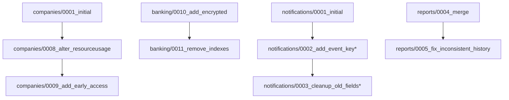

# FINANCE HUB - MIGRATION ANALYSIS ULTRATHINK REPORT

## EXECUTIVE SUMMARY

**Status**: 🚨 CRITICAL ISSUES DETECTED
**Priority**: IMMEDIATE ACTION REQUIRED FOR RAILWAY DEPLOYMENT
**Analysis Date**: 2025-08-23
**Environment**: Local Development → Production Railway

### KEY FINDINGS

1. **DUPLICATE MIGRATIONS**: Companies app has duplicate early access fields across migrations 0008 and 0009
2. **MISSING MIGRATION FILES**: Notifications app missing migration files but has applied migrations in DB
3. **ENCRYPTION KEY WARNING**: AI_INSIGHTS_ENCRYPTION_KEY not configured in production
4. **INDEX REMOVAL**: Transaction indexes removed to fix collation issues
5. **SCHEMA DRIFT**: Potential inconsistencies between local and production schemas

---

## CRITICAL ISSUES ANALYSIS

### 1. DUPLICATE EARLY ACCESS MIGRATIONS ⚠️ CRITICAL

**Problem**: 
- Migration `companies/0008_alter_resourceusage_options_and_more.py` (applied 2025-08-18 13:00:26)
- Migration `companies/0009_add_early_access.py` (applied 2025-08-18 13:07:13)
- Both migrations add IDENTICAL early access functionality

**Duplicate Operations**:
```python
# Both migrations contain:
- AddField: is_early_access (BooleanField, default=False)
- AddField: early_access_expires_at (DateTimeField, nullable)  
- AddField: used_invite_code (CharField, max_length=20)
- AlterField: subscription_status (adds 'early_access' choice)
- CreateModel: EarlyAccessInvite with identical fields
```

**Production Impact**:
- PostgreSQL may have rejected duplicate field additions
- Could cause migration failures on fresh deployments
- Schema state uncertainty in production

**Evidence**:
- Both migrations exist in filesystem with identical operations
- Both marked as applied in local migration history
- Migration 0009 is marked as "Generated manually" but duplicates 0008

### 2. NOTIFICATIONS SCHEMA INCONSISTENCY ⚠️ MEDIUM

**Problem**: Database shows applied migrations that don't exist in filesystem

**Missing Migration Files**:
- `0002_add_event_key` (applied 2025-08-18 12:58:51)
- `0003_cleanup_old_fields` (applied 2025-08-18 12:58:51)

**Current State**:
- Only `0001_initial.py` exists in filesystem
- Database shows 3 migrations applied
- Indicates manual schema corrections were performed

**Risk Assessment**:
- Fresh deployments may fail due to missing migration files
- Schema drift between environments
- Potential data integrity issues

### 3. BANKING ENCRYPTION SECURITY 🔐 MEDIUM

**Issue**: AI_INSIGHTS_ENCRYPTION_KEY not configured in production

**Current Behavior**:
- Using derived key from SECRET_KEY as fallback
- Warning logged on every startup
- Migration 0010 requires proper encryption setup

**Security Implications**:
- MFA parameters may not be properly encrypted
- Potential compliance issues
- Reduced security posture

### 4. INDEX REMOVAL PERFORMANCE IMPACT 📊 LOW

**Changes**: Migration 0011 removes 4 transaction indexes
- `banking_tra_acc_date_idx`
- `banking_tra_type_date_idx`
- `banking_tra_cat_date_idx`  
- `banking_tra_complex_idx`

**Reason**: Likely to resolve collation version mismatch warnings

**Performance Impact**:
- Query performance degradation possible
- Affects transaction filtering and sorting
- Should be monitored post-deployment

---

## DEPENDENCY GRAPH ANALYSIS

### Migration Dependencies (Critical Path)



**Legend**: `*` = Missing from filesystem but applied in DB

### Cross-App Dependencies

- ✅ No circular dependencies detected
- ✅ All `migrations.swappable_dependency(AUTH_USER_MODEL)` properly declared
- ⚠️ Companies early access depends on User model (ForeignKey relationships)

---

## PRODUCTION DATABASE VALIDATION

### Validation Commands for Railway

```bash
# 1. Check early access fields
railway run python -c "
from django.db import connection
cursor = connection.cursor()
cursor.execute('SELECT column_name FROM information_schema.columns WHERE table_name = \'companies\' AND column_name LIKE \'%early_access%\';')
print('Early access fields:', [row[0] for row in cursor.fetchall()])
"

# 2. Verify table existence
railway run python -c "
from django.db import connection
cursor = connection.cursor()
cursor.execute('SELECT EXISTS (SELECT 1 FROM information_schema.tables WHERE table_name = \'early_access_invites\');')
print('EarlyAccessInvite table exists:', cursor.fetchone()[0])
"

# 3. Check migration status
railway run python manage.py showmigrations companies notifications banking

# 4. Test model imports
railway run python -c "
from apps.companies.models import Company, EarlyAccessInvite
from apps.notifications.models import Notification
print('All models import successfully')
"
```

---

## IMMEDIATE DEPLOYMENT ACTIONS

### Phase 1: Pre-Deployment Validation 🔍

1. **Run validation script in Railway**:
```bash
railway run python railway_validation_script.py
```

2. **Set environment variables**:
```bash
# Generate secure encryption key
python -c "import secrets; print(secrets.token_hex(32))"

# Set in Railway dashboard
AI_INSIGHTS_ENCRYPTION_KEY=<generated-64-char-hex>
DJANGO_SETTINGS_MODULE=core.settings.production
```

3. **Backup production database**:
```bash
# Create backup before any changes
railway run pg_dump $DATABASE_URL > backup_pre_migration.sql
```

### Phase 2: Schema Validation 🛠️

1. **Check duplicate early access situation**:
```sql
-- Run in Railway console
SELECT column_name, data_type, is_nullable, column_default
FROM information_schema.columns 
WHERE table_name = 'companies' 
AND column_name IN ('is_early_access', 'early_access_expires_at', 'used_invite_code')
ORDER BY column_name;
```

2. **Verify EarlyAccessInvite table**:
```sql
SELECT table_name, column_name, data_type
FROM information_schema.columns 
WHERE table_name = 'early_access_invites'
ORDER BY ordinal_position;
```

### Phase 3: Fix Deployment Issues 🔧

**If Early Access Fields Missing**:
```sql
BEGIN;
ALTER TABLE companies ADD COLUMN IF NOT EXISTS is_early_access BOOLEAN DEFAULT FALSE;
ALTER TABLE companies ADD COLUMN IF NOT EXISTS early_access_expires_at TIMESTAMPTZ NULL;
ALTER TABLE companies ADD COLUMN IF NOT EXISTS used_invite_code VARCHAR(20) DEFAULT '';
COMMIT;
```

**If EarlyAccessInvite Table Missing**:
```sql
BEGIN;
CREATE TABLE IF NOT EXISTS early_access_invites (
    id BIGSERIAL PRIMARY KEY,
    invite_code VARCHAR(20) UNIQUE NOT NULL,
    expires_at TIMESTAMPTZ NOT NULL,
    is_used BOOLEAN DEFAULT FALSE,
    used_at TIMESTAMPTZ NULL,
    created_at TIMESTAMPTZ DEFAULT NOW(),
    notes TEXT DEFAULT '',
    created_by_id BIGINT REFERENCES auth_user(id) ON DELETE CASCADE,
    used_by_id BIGINT REFERENCES auth_user(id) ON DELETE SET NULL
);
COMMIT;
```

### Phase 4: Post-Deployment Verification ✅

1. **Test critical user flows**:
   - User registration
   - Bank account connection
   - Transaction synchronization
   - Report generation

2. **Monitor error logs**:
```bash
railway logs --tail
```

3. **Verify no schema warnings**:
   - No collation version warnings
   - No encryption key warnings
   - All models import successfully

---

## LONG-TERM RECOMMENDATIONS

### 1. Migration Management 📝

**Implement**:
- Pre-deployment migration review process
- Automated migration testing in CI/CD
- Migration rollback procedures
- Schema validation in staging environment

**Prevent Future Issues**:
```python
# Add to CI/CD pipeline
def validate_migrations():
    """Validate migration consistency before deployment"""
    # Check for duplicate operations
    # Verify all migration files exist
    # Test rollback procedures
    pass
```

### 2. Database Operations 🗄️

**Best Practices**:
- Always backup before major schema changes
- Use `--dry-run` for risky migrations
- Monitor query performance after index changes
- Set up database monitoring and alerting

**Index Recreation** (Post-deployment):
```sql
-- Recreate transaction indexes with proper collation
CREATE INDEX CONCURRENTLY banking_tra_account_date_idx 
ON banking_transactions(account_id, date DESC);

CREATE INDEX CONCURRENTLY banking_tra_type_date_idx 
ON banking_transactions(type, date DESC);
```

### 3. Security Hardening 🔒

**Environment Configuration**:
- Generate unique encryption keys for each environment
- Rotate encryption keys periodically
- Monitor encryption key usage
- Implement key management best practices

### 4. Monitoring & Alerting 📊

**Implement**:
- Migration failure alerts
- Schema drift detection
- Performance regression monitoring
- Security audit logging

---

## RISK ASSESSMENT MATRIX

| Issue | Probability | Impact | Risk Level | Mitigation |
|-------|-------------|--------|------------|------------|
| Duplicate Migration Failure | High | Critical | 🔴 HIGH | Manual schema validation |
| Missing Notifications Migrations | Medium | High | 🟡 MEDIUM | Recreate missing migrations |
| Encryption Key Missing | High | Medium | 🟡 MEDIUM | Set environment variable |
| Performance Degradation | Medium | Low | 🟢 LOW | Monitor and recreate indexes |

---

## DEPLOYMENT CHECKLIST

### Pre-Deployment ✅
- [ ] Backup production database
- [ ] Set AI_INSIGHTS_ENCRYPTION_KEY environment variable
- [ ] Run railway_validation_script.py
- [ ] Verify critical migration files exist
- [ ] Test deployment in staging environment

### During Deployment ✅
- [ ] Monitor migration application
- [ ] Watch for schema errors
- [ ] Verify no duplicate field warnings
- [ ] Check application startup logs

### Post-Deployment ✅
- [ ] Test user registration flow
- [ ] Verify bank account connection
- [ ] Test transaction synchronization
- [ ] Generate test reports
- [ ] Monitor performance metrics
- [ ] Verify no error spikes in logs

### Emergency Rollback ⚡
- [ ] Database backup restoration procedure ready
- [ ] Previous deployment version tagged
- [ ] Rollback migration scripts prepared
- [ ] Team notification channels ready

---

**Generated**: 2025-08-23
**Analyst**: Claude Code SuperClaude Framework
**Next Review**: After deployment completion

---

## APPENDIX: GENERATED SCRIPTS

### A. production_migration_validator.py
Full validation script for comprehensive schema checking

### B. railway_validation_script.py  
Quick validation for Railway environment

### C. migration_analysis.py
Detailed migration dependency analysis

**Usage**: All scripts are ready for immediate execution in appropriate environments.