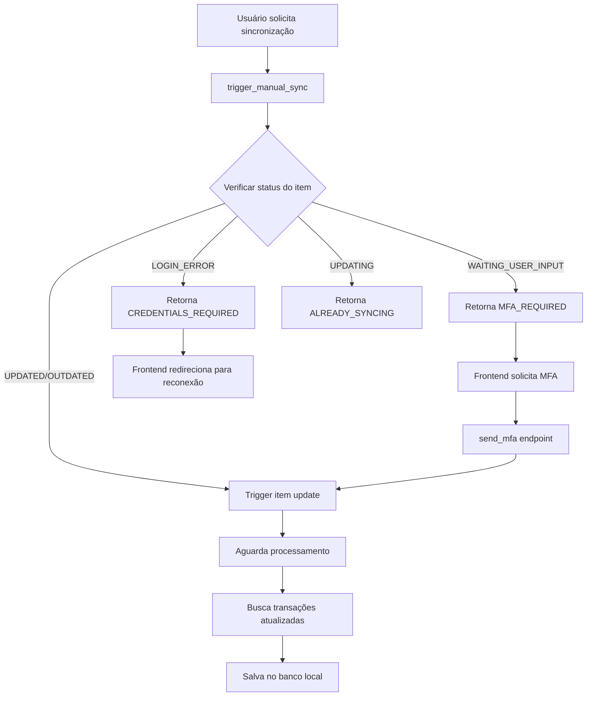

# Implementação de Sincronização Manual com Atualização de Item - Pluggy

## Problema Resolvido
A sincronização manual funcionava apenas na primeira vez. Para sincronizações subsequentes, o item na Pluggy precisava ser atualizado primeiro para buscar novas transações desde a última sincronização. Sem isso, a API retornava apenas os dados já cached.

## Solução Implementada

### 1. PluggyClient (`pluggy_client.py`)

#### Métodos Atualizados/Adicionados:
- **`update_item()`**: Modificado para aceitar credenciais opcionais. Payload vazio `{}` triggera sync com credenciais existentes
- **`trigger_item_update()`**: Novo método para forçar atualização de dados sem alterar credenciais
- **`send_mfa()`**: Novo método para enviar MFA quando item está em status `WAITING_USER_INPUT`

### 2. BankConnectionService (`services.py`)

#### Novo Método:
- **`trigger_manual_sync()`**: Gerencia o processo de sincronização manual com tratamento de diferentes status:
  - `UPDATED/OUTDATED`: Triggera atualização do item
  - `WAITING_USER_INPUT`: Retorna que MFA é necessário
  - `LOGIN_ERROR`: Retorna que credenciais são inválidas
  - `UPDATING`: Informa que sincronização já está em progresso

### 3. TransactionService (`services.py`)

#### Métodos Modificados:
- **`sync_transactions()`**: Adicionado parâmetro `trigger_update` (default: True) para atualizar item antes de sincronizar
- **`sync_all_accounts_transactions()`**: Atualiza item uma vez para toda a conexão, evitando múltiplas atualizações

### 4. Views (`views.py`)

#### Endpoints Atualizados/Adicionados:
- **`sync_transactions`**: Melhorado para retornar status detalhados (MFA_REQUIRED, CREDENTIALS_REQUIRED, SUCCESS)
- **`send_mfa`**: Novo endpoint para enviar token MFA
- **`check_status`**: Novo endpoint para verificar status atual da conexão
- **`connect_token`**: Modificado para suportar atualização de item existente via parâmetro `item_id`

## Fluxo de Sincronização Manual



## Como Usar

### 1. Sincronização Manual Simples
```python
# Via API
POST /api/banking/connections/{id}/sync_transactions/
```

### 2. Sincronização com Tratamento de MFA
```python
# 1. Tentar sincronizar
response = POST /api/banking/connections/{id}/sync_transactions/

# 2. Se MFA necessário
if response.status == 'MFA_REQUIRED':
    # Mostrar input para usuário
    # Enviar token MFA
    POST /api/banking/connections/{id}/send_mfa/
    {
        "mfa_value": "123456"
    }

    # 3. Tentar sincronizar novamente
    POST /api/banking/connections/{id}/sync_transactions/
```

### 3. Verificar Status
```python
GET /api/banking/connections/{id}/check_status/
```

### 4. Comando de Teste
```bash
# Testar sincronização para uma conexão
python manage.py test_manual_sync --connection-id 1

# Testar com item ID direto
python manage.py test_manual_sync --item-id "abc123"

# Testar para usuário específico
python manage.py test_manual_sync --user-email user@example.com
```

## Referências da Documentação Pluggy

- [Updating an Item](https://docs.pluggy.ai/docs/updating-an-item)
- [Items Update API](https://docs.pluggy.ai/reference/items-update)
- [Data Sync Update](https://docs.pluggy.ai/docs/data-sync-update-an-item)
- [Items Send MFA](https://docs.pluggy.ai/reference/items-send-mfa)

## Notas Importantes

1. **Atualização Automática**: Pluggy atualiza itens automaticamente a cada 24/12/8 horas dependendo do plano
2. **Sincronização Manual**: Deve sempre triggerar `update_item` antes de buscar transações
3. **MFA**: Alguns bancos (XP, Bradesco, Easynvest) sempre requerem MFA para atualização
4. **Limite de Dados**: Cada sync recupera até 3 dias adicionais de transações desde a última sincronização
5. **Cache de Tokens**: Connect tokens são cached por 25 minutos, API keys por 1h50m

## Status de Item na Pluggy

- `UPDATED`: Item atualizado e pronto para consulta
- `OUTDATED`: Item precisa de atualização
- `UPDATING`: Atualização em progresso
- `WAITING_USER_INPUT`: Esperando MFA do usuário
- `LOGIN_ERROR`: Credenciais inválidas
- `ERROR`: Erro geral na conexão