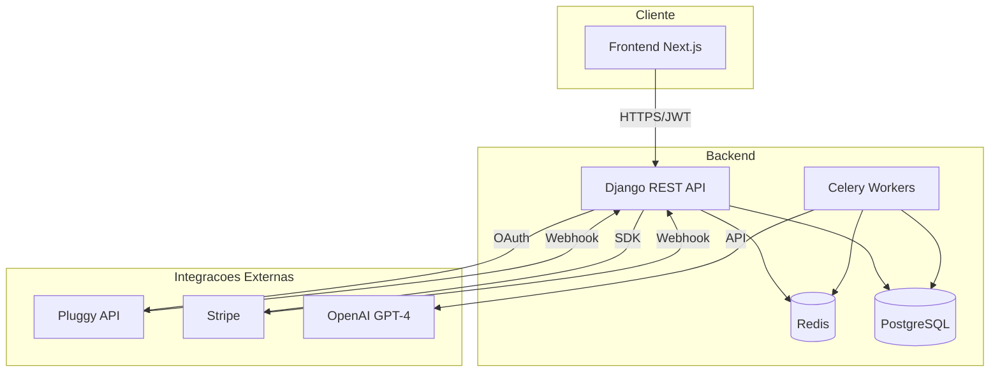
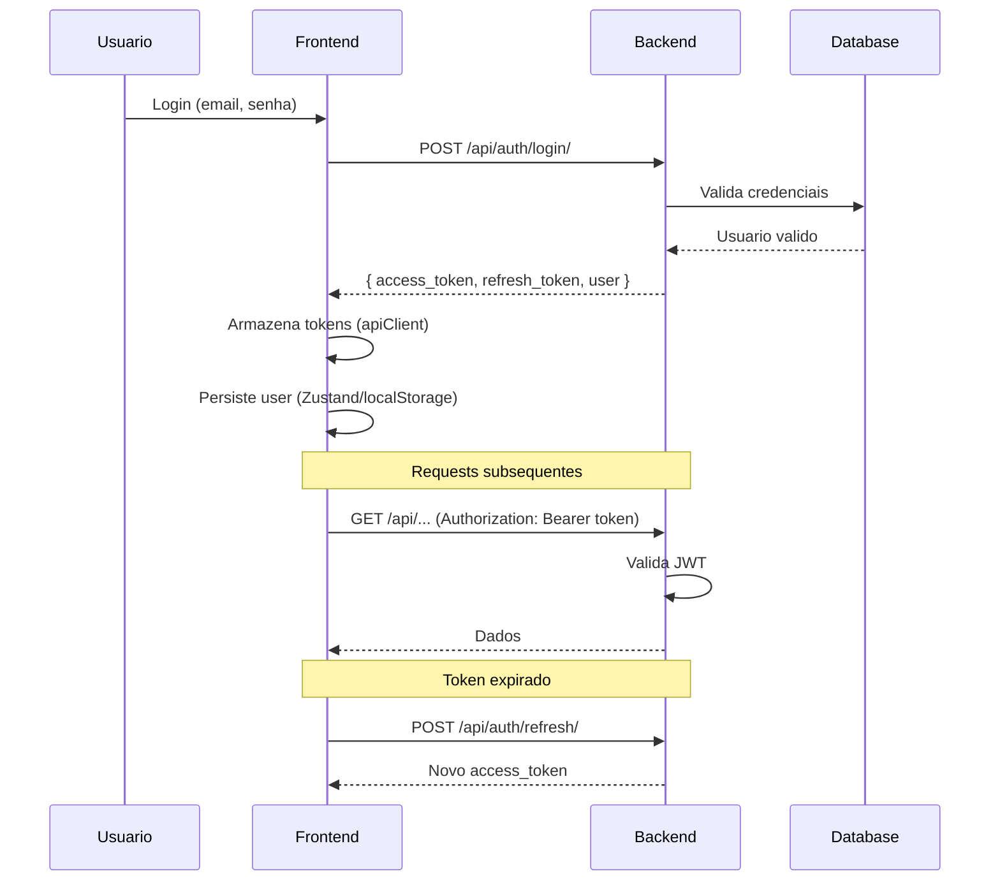
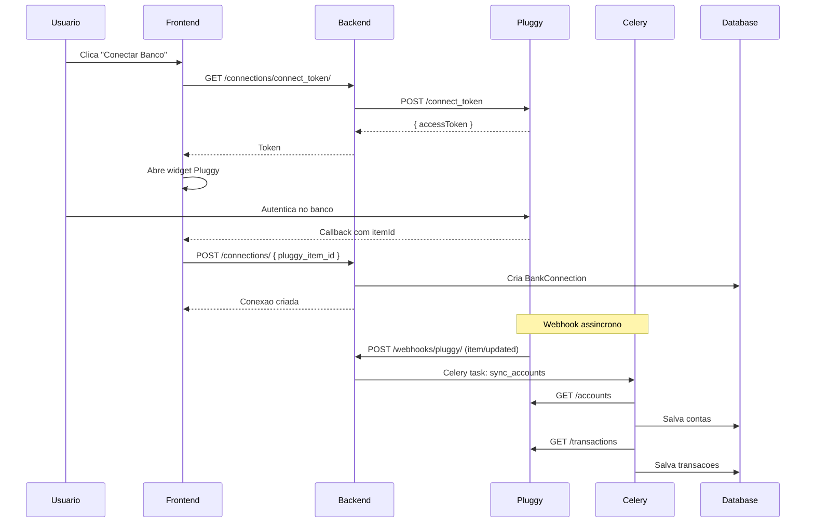
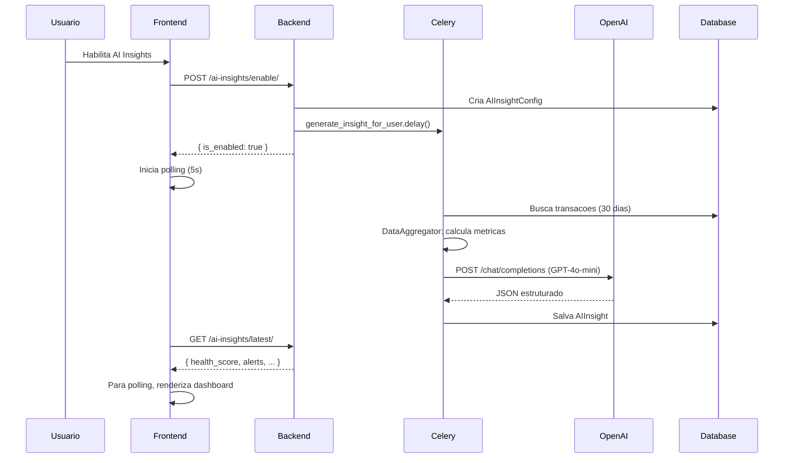
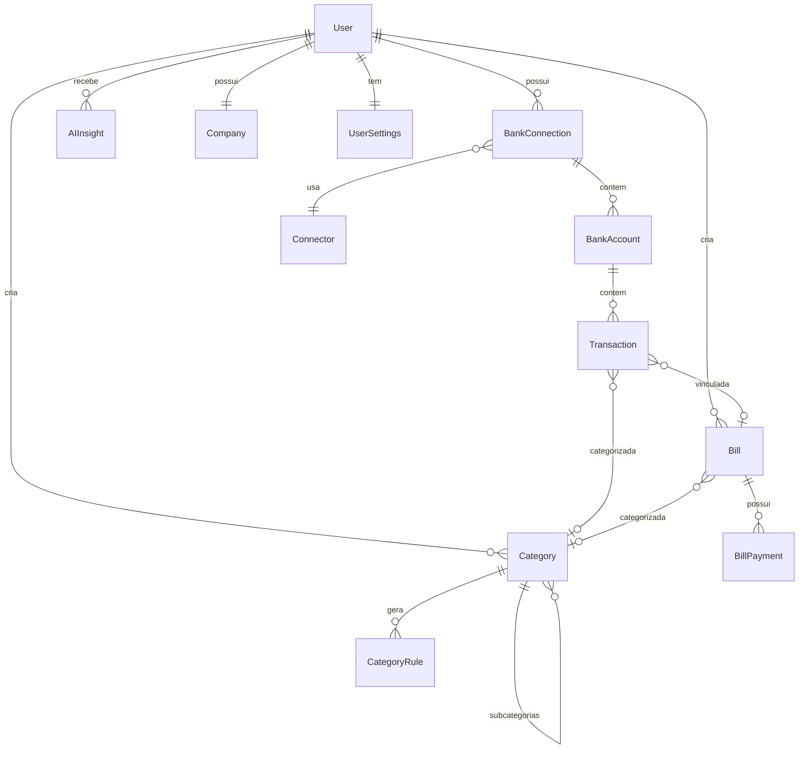

# Arquitetura do CaixaHub

## Visao Geral

O CaixaHub e uma aplicacao web full-stack para gestao financeira de PMEs brasileiras. A arquitetura segue o padrao cliente-servidor com separacao clara entre frontend (Next.js) e backend (Django REST).



---

## Stack Tecnologico

### Backend

| Tecnologia | Versao | Proposito |
|------------|--------|-----------|
| Python | 3.11+ | Runtime |
| Django | 4.x | Framework web |
| Django REST Framework | 3.14+ | API REST |
| PostgreSQL | 14+ | Banco de dados principal |
| Redis | 7+ | Cache e broker de filas |
| Celery | 5.x | Processamento assincrono |
| SimpleJWT | 5.x | Autenticacao JWT |
| dj-stripe | 2.x | Integracao Stripe |

### Frontend

| Tecnologia | Versao | Proposito |
|------------|--------|-----------|
| Next.js | 14.x | Framework React |
| React | 18.x | UI Library |
| TypeScript | 5.x | Type safety |
| Tailwind CSS | 3.x | Estilizacao |
| Shadcn/ui | - | Componentes UI |
| Zustand | 4.x | State management |
| React Query | 5.x | Data fetching/cache |
| Recharts | 2.x | Graficos |

---

## Estrutura de Modulos

### Backend Apps

```
backend/apps/
├── authentication/     # Gerenciamento de usuarios
│   ├── models.py       # User, PasswordReset, UserActivityLog, UserSettings
│   ├── views.py        # Login, register, profile
│   └── serializers.py
│
├── banking/            # Core financeiro
│   ├── models.py       # Connector, BankConnection, BankAccount,
│   │                   # Transaction, Category, Bill, BillPayment, CategoryRule
│   ├── views.py        # 8 ViewSets
│   ├── services.py     # ConnectorService, BankConnectionService, etc
│   ├── pluggy_client.py # Client API Pluggy
│   ├── ocr_service.py  # OCR de boletos
│   ├── webhooks.py     # Handler webhook Pluggy
│   └── tasks.py        # Celery tasks
│
├── ai_insights/        # Analise com IA
│   ├── models.py       # AIInsightConfig, AIInsight
│   ├── views.py        # AIInsightViewSet
│   └── services/
│       ├── insight_generator.py
│       ├── data_aggregator.py
│       └── openai_service.py
│
├── subscriptions/      # Pagamentos
│   ├── models.py       # TrialUsageTracking
│   ├── views.py        # Checkout, portal, status
│   └── services.py     # Helpers Stripe
│
├── companies/          # Dados empresa
│   ├── models.py       # Company
│   └── views.py        # CompanyDetailView
│
└── reports/            # Relatorios
    ├── views.py        # ReportsViewSet (DRE, cash flow, etc)
    └── services.py     # Geracao de relatorios
```

### Frontend Structure

```
frontend/
├── app/
│   ├── (auth)/              # Rotas publicas
│   │   ├── login/
│   │   ├── register/
│   │   └── forgot-password/
│   │
│   └── (dashboard)/         # Rotas protegidas
│       ├── layout.tsx       # Auth guard, subscription check
│       ├── dashboard/       # Home
│       ├── accounts/        # Conexoes bancarias
│       ├── transactions/    # Listagem transacoes
│       ├── categories/      # CRUD categorias
│       ├── bills/           # Contas a pagar/receber
│       ├── reports/         # Relatorios
│       ├── ai-insights/     # IA
│       └── settings/        # Configuracoes
│
├── components/
│   ├── ui/                  # Componentes base (Shadcn)
│   ├── banking/             # Componentes de negocio
│   ├── charts/              # Graficos
│   └── layouts/             # MainLayout, AuthLayout
│
├── services/                # API clients
│   ├── banking.service.ts   # Principal - contas, transacoes
│   ├── bills.service.ts
│   ├── ai-insights.service.ts
│   └── subscription.service.ts
│
├── hooks/                   # Custom hooks
│   ├── use-banking.ts       # React Query wrapper
│   └── useSyncStatus.ts     # Polling de sincronizacao
│
└── store/
    └── auth-store.ts        # Zustand - autenticacao
```

---

## Fluxo de Dados

### Autenticacao (JWT)



### Sincronizacao Bancaria



### Geracao de AI Insights



---

## Modelos de Dados Principais

### Diagrama ER Simplificado



### Campos Principais por Modelo

| Modelo | Campos Chave | Relacionamentos |
|--------|--------------|-----------------|
| **User** | email, first_name, phone, signup_price_id | BankConnection, Category, Bill, AIInsight |
| **BankConnection** | pluggy_item_id, status, last_updated_at | User, Connector, BankAccount |
| **BankAccount** | type, balance, credit_limit | BankConnection, Transaction |
| **Transaction** | amount, type, date, description | BankAccount, Category (user_category), Bill |
| **Category** | name, type, color, icon, parent | User, Transaction, Bill, CategoryRule |
| **Bill** | type, amount, due_date, status | User, Category, Transaction, BillPayment |
| **AIInsight** | health_score, alerts, predictions | User |

---

## Seguranca

### Autenticacao e Autorizacao

| Camada | Mecanismo |
|--------|-----------|
| Autenticacao | JWT (SimpleJWT) com refresh tokens |
| Autorizacao | IsAuthenticated (maioria dos endpoints) |
| CORS | Configurado para dominios permitidos |
| CSRF | Desabilitado para API (JWT e seguro), mantido para webhooks |

### Protecao de Webhooks

```python
# Verificacao HMAC-SHA256 para Pluggy
signature = hmac.new(
    webhook_secret.encode(),
    request.body,
    hashlib.sha256
).hexdigest()

if signature != request.headers.get('X-Pluggy-Signature'):
    return 401
```

### Idempotencia

```python
# Cache de eventos processados (7 dias)
cache_key = f"webhook_event_{event_id}"
if cache.get(cache_key):
    return 200  # Ja processado
cache.set(cache_key, True, timeout=7*24*60*60)
```

---

## Processamento Assincrono

### Celery Tasks

| Task | Trigger | Proposito |
|------|---------|-----------|
| `process_item_updated` | Webhook Pluggy | Sincroniza contas e transacoes |
| `process_item_created` | Webhook Pluggy | Cria conexao inicial |
| `process_transactions_*` | Webhook Pluggy | Atualiza transacoes |
| `generate_insight_for_user` | API enable/regenerate | Gera insight com OpenAI |

### Configuracao Celery

```python
# core/celery.py
app = Celery('caixahub')
app.config_from_object('django.conf:settings', namespace='CELERY')
app.autodiscover_tasks()

# Broker: Redis
CELERY_BROKER_URL = os.environ.get('REDIS_URL')
```

---

## Integracoes Externas

### Pluggy (Agregador Bancario)

| Endpoint | Metodo | Proposito |
|----------|--------|-----------|
| `/auth` | POST | Autenticacao (cache 2h) |
| `/connect_token` | POST | Token para widget (cache 25m) |
| `/connectors` | GET | Lista de bancos |
| `/items` | POST/GET/PATCH/DELETE | CRUD de conexoes |
| `/accounts` | GET | Lista contas de um item |
| `/transactions` | GET | Lista transacoes (paginado) |

### Stripe

| Recurso | Uso |
|---------|-----|
| Checkout Session | Criacao de assinatura com trial |
| Customer Portal | Gerenciamento pelo usuario |
| Webhooks | Sincronizacao automatica (dj-stripe) |

### OpenAI

| Modelo | Uso |
|--------|-----|
| GPT-4o-mini | Analise financeira, geracao de insights |

---

## Performance

### Estrategias de Cache

| Dado | TTL | Mecanismo |
|------|-----|-----------|
| Pluggy API Key | 2 horas | Redis |
| Connect Token | 25 minutos | Redis |
| Webhook events | 7 dias | Redis (idempotencia) |

### Otimizacoes no Frontend

| Tecnica | Aplicacao |
|---------|-----------|
| Lazy loading | Transacoes em batches (500-1000) |
| React Query cache | Contas, categorias |
| useMemo | Calculos de relatorios |
| Parallel requests | Dashboard (5+ chamadas simultaneas) |

### Otimizacoes no Backend

| Tecnica | Aplicacao |
|---------|-----------|
| select_related | Queries com FK |
| Indices compostos | (user, date), (type, status) |
| Paginacao | Transacoes, bills |
| Celery | Processamento pesado (sync, IA) |

---

## Monitoramento e Logs

### UserActivityLog

Eventos rastreados:
- `signup`, `login`, `logout`
- `bank_connection_created`, `bank_connection_deleted`
- `sync_started`, `sync_completed`, `sync_failed`
- `ai_insights_enabled`, `ai_insights_regenerated`
- `bill_created`, `bill_payment_registered`
- `report_generated`, `report_exported_pdf`

### Campos Capturados

```python
{
    "user_id": uuid,
    "event_type": str,
    "ip_address": str,
    "user_agent": str,
    "metadata": {}, # contexto adicional
    "created_at": datetime
}
```

---

## Deploy

### Railway

```toml
# railway.toml
[build]
builder = "nixpacks"

[deploy]
startCommand = "python manage.py migrate && gunicorn core.wsgi"
healthcheckPath = "/health/"
```

### Variaveis de Ambiente

```bash
# Obrigatorias
DJANGO_SECRET_KEY
DATABASE_URL
REDIS_URL
PLUGGY_CLIENT_ID
PLUGGY_CLIENT_SECRET
STRIPE_SECRET_KEY
OPENAI_API_KEY
FRONTEND_URL

# Opcionais
DEBUG=false
SENTRY_DSN
```

---

## Proximos Passos / Melhorias Futuras

1. **Rate Limiting** - Implementar django-ratelimit
2. **Caching agressivo** - Redis para queries frequentes
3. **Testes automatizados** - Cobertura de testes unitarios e integracao
4. **CI/CD** - Pipeline automatizado
5. **Observabilidade** - Metricas Prometheus/Grafana
