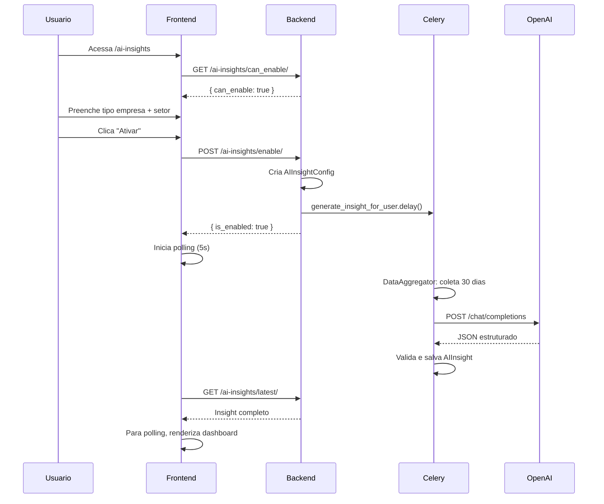
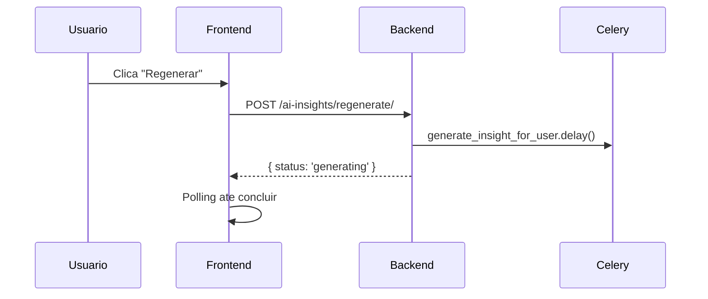

# AI Insights

## Proposito

Analise financeira automatizada com inteligencia artificial, gerando health score, alertas, oportunidades, previsoes e recomendacoes personalizadas baseadas nos dados financeiros do usuario.

---

## Componentes Principais

### Backend

| Componente | Arquivo | Responsabilidade |
|------------|---------|------------------|
| AIInsightConfig Model | `backend/apps/ai_insights/models.py:10` | Configuracao por usuario |
| AIInsight Model | `backend/apps/ai_insights/models.py:40` | Insight gerado |
| AIInsightViewSet | `backend/apps/ai_insights/views.py` | Endpoints |
| InsightGenerator | `backend/apps/ai_insights/services/insight_generator.py` | Orquestrador |
| DataAggregator | `backend/apps/ai_insights/services/data_aggregator.py` | Coleta metricas |
| OpenAIService | `backend/apps/ai_insights/services/openai_service.py` | Chamada GPT |

### Frontend

| Componente | Arquivo | Responsabilidade |
|------------|---------|------------------|
| AI Insights Page | `frontend/app/(dashboard)/ai-insights/page.tsx` | Dashboard principal |
| History Page | `frontend/app/(dashboard)/ai-insights/history/page.tsx` | Historico |
| HealthScoreCard | `frontend/app/(dashboard)/ai-insights/components/HealthScoreCard.tsx` | Score visual |
| InsightCard | `frontend/app/(dashboard)/ai-insights/components/InsightCard.tsx` | Alertas/oportunidades |

---

## Fluxo do Usuario

### Habilitar AI Insights



### Regenerar Insight



---

## Estrutura do Insight

### Health Score

| Score | Status | Cor | Significado |
|-------|--------|-----|-------------|
| 9-10 | Excelente | Verde | Saude financeira otima |
| 7-8.9 | Bom | Azul | Boa gestao, pequenas melhorias |
| 5-6.9 | Regular | Amarelo | Atencao necessaria |
| 0-4.9 | Ruim | Vermelho | Situacao critica |

### Alertas

```json
{
  "type": "alert",
  "severity": "high",
  "title": "Gastos excessivos em Alimentacao",
  "description": "Nos ultimos 30 dias, gastos com alimentacao aumentaram 45%",
  "recommendation": "Considere revisar assinaturas de delivery"
}
```

| Severidade | Cor | Prioridade |
|------------|-----|------------|
| high | Vermelho | Imediata |
| medium | Amarelo | Atencao |
| low | Azul | Informativo |

### Oportunidades

```json
{
  "type": "opportunity",
  "title": "Potencial de economia",
  "description": "Identificamos R$ 500 em assinaturas pouco utilizadas",
  "recommendation": "Revise servicos de streaming duplicados"
}
```

### Previsoes

```json
{
  "next_month_cash_flow": 16500.00,
  "confidence": "high",
  "reasoning": "Baseado em receitas recorrentes e padrao de despesas"
}
```

### Recomendacoes

Lista ordenada de acoes sugeridas:
1. Criar reserva de emergencia (3-6 meses)
2. Renegociar tarifas bancarias
3. Consolidar gastos de cartao

---

## Regras de Negocio

### Pre-requisitos para Habilitar

```python
# backend/apps/ai_insights/services/insight_generator.py
def can_generate_for_user(user):
    # Deve ter pelo menos uma conexao ativa
    has_connection = BankConnection.objects.filter(
        user=user,
        is_active=True
    ).exists()

    # Deve ter transacoes nos ultimos 30 dias
    has_transactions = Transaction.objects.filter(
        account__connection__user=user,
        date__gte=timezone.now() - timedelta(days=30)
    ).exists()

    return has_connection and has_transactions
```

### Frequencia de Geracao

| Evento | Acao |
|--------|------|
| Habilitacao | Gera imediatamente |
| Regeneracao manual | Gera imediatamente |
| Sincronizacao | Nao gera automaticamente |

### Periodo Analisado

- **Padrao**: Ultimos 30 dias
- **Campos no modelo**: `period_start`, `period_end`

---

## Integracao OpenAI

### Modelo

| Campo | Valor |
|-------|-------|
| Modelo | GPT-4o-mini |
| Temperature | 0.7 |
| Max tokens | 2000 |

### Prompt Estruturado

```python
# backend/apps/ai_insights/services/openai_service.py
system_prompt = """
Voce e um consultor financeiro especializado em PMEs brasileiras.
Analise os dados financeiros e gere um relatorio estruturado.

Retorne APENAS JSON valido no formato:
{
  "health_score": 0-10,
  "health_status": "Excelente|Bom|Regular|Ruim",
  "summary": "Resumo executivo",
  "insights": [
    {
      "type": "alert|opportunity",
      "severity": "high|medium|low",
      "title": "...",
      "description": "...",
      "recommendation": "..."
    }
  ],
  "predictions": {
    "next_month_cash_flow": 0.00,
    "confidence": "high|medium|low",
    "reasoning": "..."
  },
  "top_recommendations": ["...", "...", "..."]
}
"""
```

### Dados Enviados

```python
# backend/apps/ai_insights/services/data_aggregator.py
def aggregate_data(user, days=30):
    return {
        "period": {"start": start_date, "end": end_date},
        "summary": {
            "total_income": sum_income,
            "total_expenses": sum_expenses,
            "balance": balance,
            "transaction_count": count
        },
        "category_breakdown": {
            "Alimentacao": 5000.00,
            "Transporte": 3000.00,
            # ...
        },
        "trends": {
            "income_trend": "+5%",  # vs periodo anterior
            "expense_trend": "-2%"
        },
        "company_info": {
            "type": "mei",
            "sector": "services"
        }
    }
```

### Validacao da Resposta

```python
def validate_response(data):
    required = ['health_score', 'health_status', 'summary', 'insights']
    for field in required:
        if field not in data:
            raise ValidationError(f'Campo obrigatorio: {field}')

    if not 0 <= data['health_score'] <= 10:
        raise ValidationError('health_score deve ser 0-10')

    valid_status = ['Excelente', 'Bom', 'Regular', 'Ruim']
    if data['health_status'] not in valid_status:
        raise ValidationError('health_status invalido')
```

---

## Estados Possiveis

### Pagina Principal

| Estado | Condicao | UI |
|--------|----------|-----|
| Nao habilitado | config.is_enabled = false | Form de ativacao |
| Gerando | Habilitado, sem insight | Spinner + polling |
| Erro | insight.has_error = true | Card de erro + retry |
| Sucesso | Insight gerado | Dashboard completo |

### Durante Geracao

```typescript
// frontend/app/(dashboard)/ai-insights/page.tsx
useEffect(() => {
  if (config?.is_enabled && !latestInsight) {
    const interval = setInterval(async () => {
      const insight = await aiInsightsService.getLatest();
      if (insight) {
        setLatestInsight(insight);
        clearInterval(interval);
      }
    }, 5000);
    return () => clearInterval(interval);
  }
}, [config, latestInsight]);
```

---

## Componentes Visuais

### HealthScoreCard

```
+------------------------------------------+
|  SAUDE FINANCEIRA                        |
|                                          |
|     [======= 7.5 =======]                |
|           BOM                            |
|                                          |
|  Variacao: +0.5 vs anterior              |
+------------------------------------------+
```

### InsightCard (Alerta)

```
+------------------------------------------+
| !!! ALERTA - Alta Severidade             |
+------------------------------------------+
| Gastos excessivos em Alimentacao         |
|                                          |
| Nos ultimos 30 dias, gastos com          |
| alimentacao aumentaram 45% comparado     |
| ao periodo anterior.                     |
|                                          |
| Recomendacao: Considere revisar          |
| assinaturas de delivery.                 |
+------------------------------------------+
```

### PredictionsCard

```
+------------------------------------------+
| PREVISAO PROXIMO MES                     |
+------------------------------------------+
| Fluxo de Caixa: R$ 16.500,00             |
| Confianca: Alta                          |
|                                          |
| Baseado em receitas recorrentes e        |
| padrao historico de despesas.            |
+------------------------------------------+
```

---

## Integracao com Outros Modulos

| Modulo | Integracao |
|--------|------------|
| Banking | Transacoes como entrada |
| Companies | Tipo empresa e setor |
| Subscriptions | Requer assinatura ativa |

---

## API de AI Insights

### Endpoints

| Metodo | Endpoint | Descricao |
|--------|----------|-----------|
| GET | `/ai-insights/can_enable/` | Verifica pre-requisitos |
| GET | `/ai-insights/config/` | Configuracao atual |
| POST | `/ai-insights/enable/` | Habilitar (com company data) |
| POST | `/ai-insights/disable/` | Desabilitar |
| GET | `/ai-insights/latest/` | Ultimo insight |
| POST | `/ai-insights/regenerate/` | Forcar regeneracao |
| GET | `/ai-insights/history/` | Historico paginado |
| GET | `/ai-insights/{id}/` | Detalhe de um insight |
| GET | `/ai-insights/{id}/compare/` | Comparar com outro |

### Payload de Habilitacao

```json
POST /ai-insights/enable/
{
  "company_type": "mei",
  "business_sector": "services"
}
```

### Resposta do Insight

```json
{
  "id": "uuid",
  "health_score": 7.5,
  "health_status": "Bom",
  "score_change": 0.5,
  "summary": "Sua empresa apresenta boa saude financeira...",
  "alerts": [...],
  "opportunities": [...],
  "predictions": {...},
  "recommendations": [...],
  "generated_at": "2025-12-18T10:00:00Z",
  "period_start": "2025-11-18",
  "period_end": "2025-12-18",
  "has_error": false
}
```
