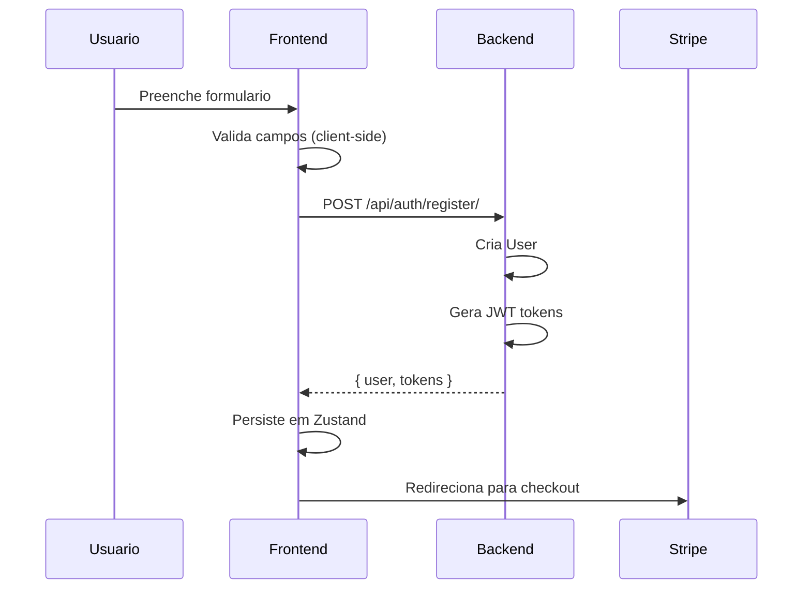
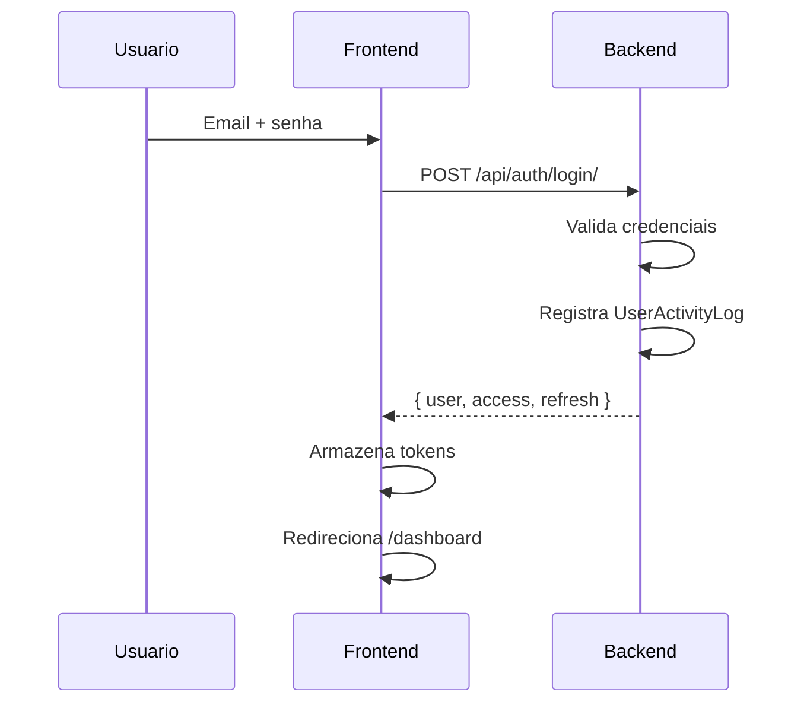

# Autenticacao

## Proposito

Sistema de autenticacao e gerenciamento de usuarios do CaixaHub, incluindo registro, login, recuperacao de senha e gerenciamento de sessao via JWT.

---

## Componentes Principais

### Backend

| Componente | Arquivo | Responsabilidade |
|------------|---------|------------------|
| User Model | `backend/apps/authentication/models.py:15` | Modelo de usuario estendido |
| UserActivityLog | `backend/apps/authentication/models.py:80` | Auditoria de eventos |
| UserSettings | `backend/apps/authentication/models.py:140` | Configuracoes do usuario |
| Views | `backend/apps/authentication/views.py` | Endpoints de auth |

### Frontend

| Componente | Arquivo | Responsabilidade |
|------------|---------|------------------|
| Login Page | `frontend/app/(auth)/login/page.tsx` | Formulario de login |
| Register Page | `frontend/app/(auth)/register/page.tsx` | Formulario de registro |
| Auth Store | `frontend/store/auth-store.ts` | Estado global de auth (Zustand) |
| Auth Service | `frontend/services/auth.service.ts` | API client |

---

## Fluxo do Usuario

### Registro



### Login



---

## Regras de Negocio

### Validacao de Senha

```typescript
// frontend/app/(auth)/register/page.tsx
const passwordValidation = {
  minLength: 8,
  hasUppercase: /[A-Z]/,
  hasLowercase: /[a-z]/,
  hasNumber: /[0-9]/,
  hasSpecial: /[!@#$%^&*]/
};
```

### Campos Obrigatorios no Registro

| Campo | Validacao |
|-------|-----------|
| first_name | Obrigatorio |
| email | Formato valido, unico |
| phone | Mascara brasileira |
| password | 8+ chars, maiuscula, minuscula, numero, especial |

### JWT Tokens

| Token | Duracao | Uso |
|-------|---------|-----|
| access_token | 5 minutos | Autorizacao de requests |
| refresh_token | 7 dias | Renovacao do access |

---

## Estados Possiveis

### Login Page

| Estado | Condicao | UI |
|--------|----------|-----|
| Inicial | Formulario vazio | Inputs habilitados |
| Loading | Durante request | Botao desabilitado, spinner |
| Erro | Credenciais invalidas | Toast de erro |
| Sucesso | Login OK | Redirect para /dashboard |

### Register Page

| Estado | Condicao | UI |
|--------|----------|-----|
| Inicial | Formulario vazio | Validacao em tempo real |
| Senha Fraca | Requisitos nao atendidos | Indicadores vermelhos |
| Senha Forte | Todos requisitos OK | Indicadores verdes |
| Loading | Durante registro | Spinner |
| Erro | Email duplicado, etc | Toast de erro |
| Sucesso | Registro OK | Redirect para checkout |

---

## Integracao com Outros Modulos

| Modulo | Integracao |
|--------|------------|
| Subscriptions | Checkout apos registro |
| Banking | User possui conexoes |
| AI Insights | User habilita/recebe insights |
| Bills | User cria contas |

---

## A/B Testing

### Campos de Tracking

```python
# backend/apps/authentication/models.py
class User(AbstractUser):
    signup_price_id = models.CharField(max_length=100, blank=True)
    acquisition_angle = models.CharField(max_length=50, blank=True)
```

### Angulos de Aquisicao

| Valor | Significado |
|-------|-------------|
| `time` | Landing focada em economia de tempo |
| `price` | Landing focada em preco |
| `delay` | Landing focada em evitar atrasos |
| `visibility` | Landing focada em visibilidade |

---

## Seguranca

### Protecoes Implementadas

- Senhas hasheadas com PBKDF2 (Django default)
- JWT com expiracao curta
- Refresh token rotativo
- Log de atividades (IP, user-agent)
- Rate limiting (recomendado adicionar)

### UserActivityLog

Eventos registrados:
- `signup` - Novo usuario criado
- `login` - Login bem-sucedido
- `logout` - Logout
- `password_reset_requested` - Solicitacao de reset
- `password_changed` - Senha alterada
- `profile_updated` - Perfil atualizado
