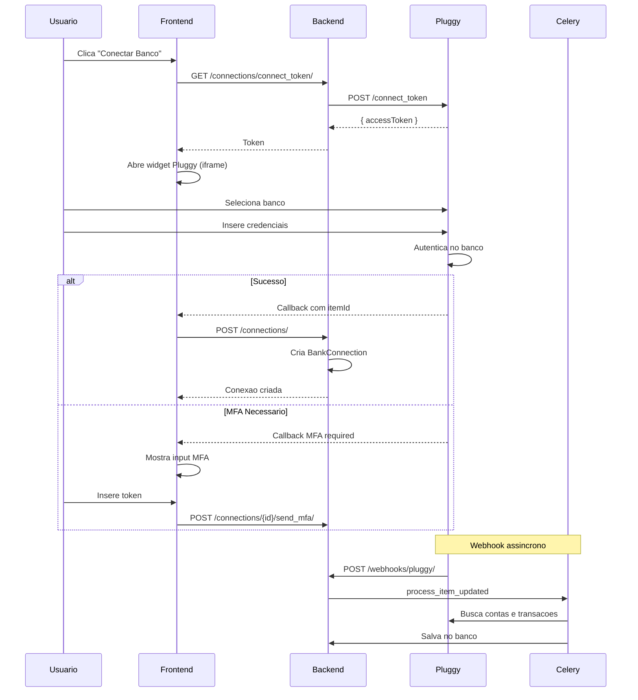
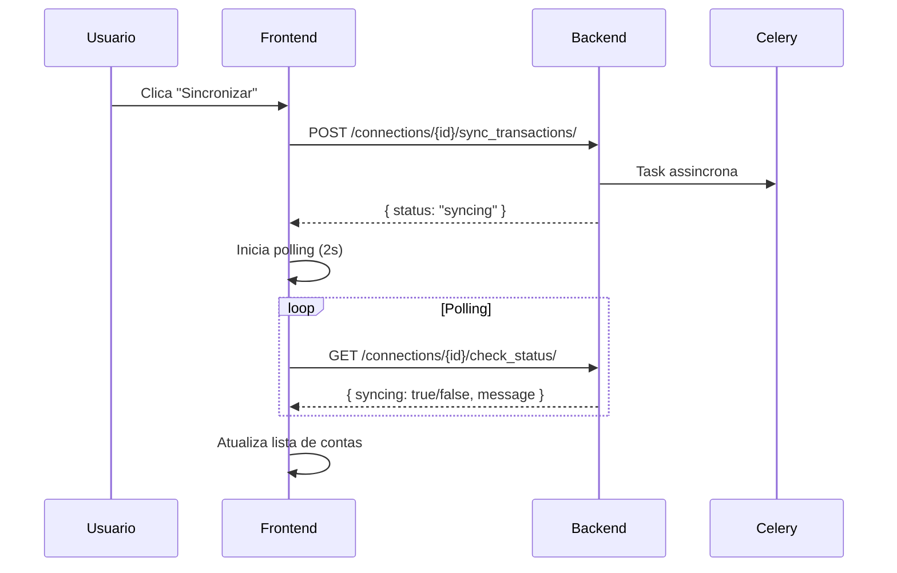

# Conexao Bancaria

## Proposito

Permite aos usuarios conectar suas contas bancarias ao CaixaHub atraves do agregador Pluggy, sincronizando automaticamente saldos e transacoes.

---

## Componentes Principais

### Backend

| Componente | Arquivo | Responsabilidade |
|------------|---------|------------------|
| Connector Model | `backend/apps/banking/models.py:20` | Instituicoes financeiras |
| BankConnection Model | `backend/apps/banking/models.py:80` | Conexoes do usuario |
| BankAccount Model | `backend/apps/banking/models.py:140` | Contas individuais |
| PluggyClient | `backend/apps/banking/pluggy_client.py` | API client Pluggy |
| BankConnectionViewSet | `backend/apps/banking/views.py:150` | Endpoints de conexao |
| Webhook Handler | `backend/apps/banking/webhooks.py` | Processa eventos Pluggy |

### Frontend

| Componente | Arquivo | Responsabilidade |
|------------|---------|------------------|
| Accounts Page | `frontend/app/(dashboard)/accounts/page.tsx` | Listagem de contas |
| PluggyConnectWidget | `frontend/components/banking/pluggy-connect-widget.tsx` | Widget de conexao |
| BankAccountCard | `frontend/components/banking/bank-account-card.tsx` | Card de conta |
| useSyncStatus Hook | `frontend/hooks/useSyncStatus.ts` | Polling de sincronizacao |

---

## Fluxo do Usuario

### Conectar Novo Banco



### Sincronizar Transacoes



---

## Regras de Negocio

### Status de Conexao

| Status | Significado | Acao Necessaria |
|--------|-------------|-----------------|
| `UPDATED` | Sincronizado com sucesso | Nenhuma |
| `UPDATING` | Sincronizacao em andamento | Aguardar |
| `LOGIN_ERROR` | Credenciais invalidas | Reconectar |
| `WAITING_USER_INPUT` | MFA necessario | Inserir token |
| `OUTDATED` | Dados desatualizados | Sincronizar |
| `ERROR` | Erro generico | Verificar detalhes |

### Tipos de Conta

| Tipo | Descricao | Campos Extras |
|------|-----------|---------------|
| `CHECKING` | Conta corrente | balance |
| `SAVINGS` | Poupanca | balance |
| `CREDIT_CARD` | Cartao de credito | credit_limit, available_credit |
| `LOAN` | Emprestimo | balance (negativo) |
| `INVESTMENT` | Investimentos | balance |

### Calculo de Saldo Total

```typescript
// frontend/app/(dashboard)/dashboard/page.tsx
const totalBalance = accounts
  .filter(acc => acc.type !== 'CREDIT_CARD')
  .reduce((sum, acc) => sum + parseFloat(acc.balance), 0);
```

---

## Estados Possiveis

### Pagina de Contas

| Estado | Condicao | UI |
|--------|----------|-----|
| Loading | Carregando contas | Skeleton |
| Vazio | Nenhuma conexao | Empty state com CTA |
| Lista | Contas carregadas | Grid de cards |
| Sincronizando | Sync em andamento | Spinner no card |
| Erro de Conexao | Status ERROR | Badge vermelho |
| Widget Aberto | Conectando | Overlay Pluggy |

### Status de Sincronizacao

| Estado | Mensagem | Acao |
|--------|----------|------|
| Iniciando | "Iniciando sincronizacao..." | Spinner |
| Buscando | "Buscando transacoes..." | Spinner |
| Completo | "Sincronizado com sucesso" | Toast verde |
| Erro | "Erro na sincronizacao" | Toast vermelho |

---

## Integracao Pluggy

### Endpoints Utilizados

| Endpoint | Metodo | Uso |
|----------|--------|-----|
| `/auth` | POST | Obter API key (cache 2h) |
| `/connect_token` | POST | Token para widget (cache 25m) |
| `/connectors` | GET | Lista bancos disponiveis |
| `/items` | POST | Criar conexao |
| `/items/{id}` | GET | Status da conexao |
| `/items/{id}` | PATCH | Atualizar/sincronizar |
| `/items/{id}/mfa` | POST | Enviar MFA |
| `/accounts` | GET | Listar contas |
| `/transactions` | GET | Listar transacoes |

### Webhook Events

| Evento | Acao |
|--------|------|
| `item/created` | Cria BankConnection |
| `item/updated` | Sincroniza contas e transacoes |
| `item/error` | Atualiza status para ERROR |
| `item/waiting_user_input` | Marca para MFA |
| `transactions/created` | Adiciona novas transacoes |
| `transactions/updated` | Atualiza transacoes existentes |

### Seguranca do Webhook

```python
# backend/apps/banking/webhooks.py
def verify_signature(request):
    signature = request.headers.get('X-Pluggy-Signature')
    expected = hmac.new(
        settings.PLUGGY_WEBHOOK_SECRET.encode(),
        request.body,
        hashlib.sha256
    ).hexdigest()
    return hmac.compare_digest(signature, expected)
```

---

## Integracao com Outros Modulos

| Modulo | Integracao |
|--------|------------|
| Transactions | Transacoes sincronizadas automaticamente |
| Dashboard | Saldo total e transacoes recentes |
| Reports | Dados para relatorios |
| AI Insights | Base de dados para analise |

---

## Tratamento de Erros

### Erros Comuns

| Erro | Causa | Solucao |
|------|-------|---------|
| `LOGIN_ERROR` | Senha alterada no banco | Reconectar |
| `SITE_NOT_AVAILABLE` | Banco fora do ar | Aguardar e tentar novamente |
| `INVALID_CREDENTIALS` | Credenciais incorretas | Verificar dados |
| `MFA_REQUIRED` | Token necessario | Inserir token MFA |

### Reconexao

```typescript
// frontend/app/(dashboard)/accounts/page.tsx
const handleReconnect = async (connectionId: string) => {
  const token = await bankingService.getReconnectToken(connectionId);
  setUpdateItemId(connection.pluggy_item_id);
  setConnectToken(token);
  setShowPluggyWidget(true);
};
```
