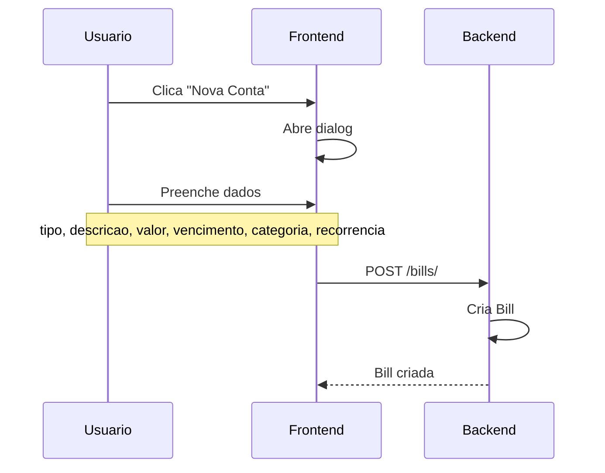
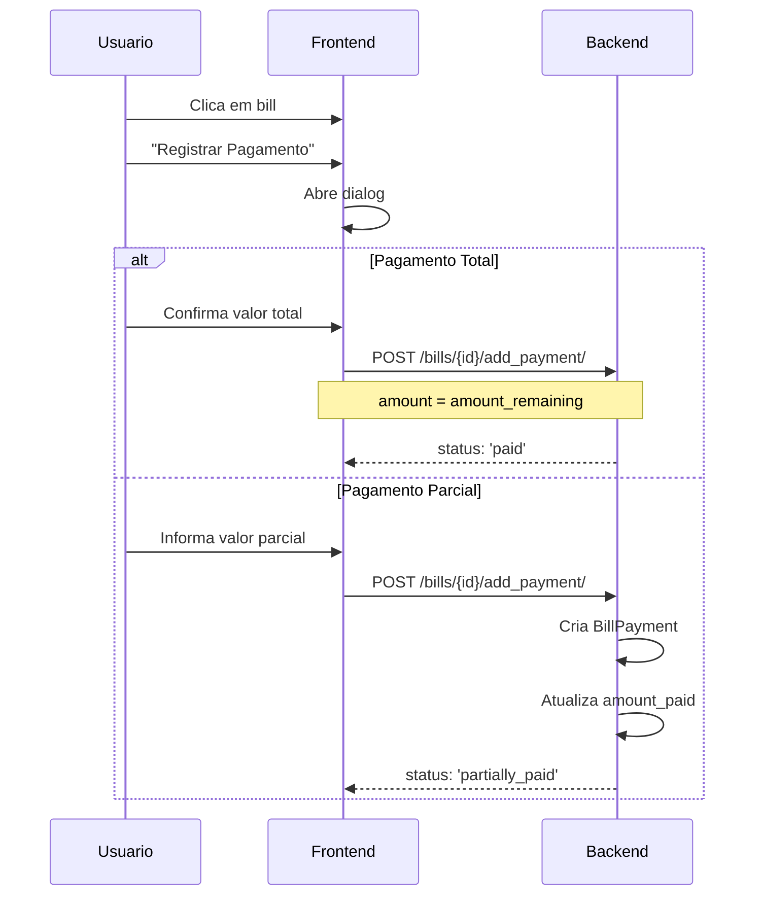
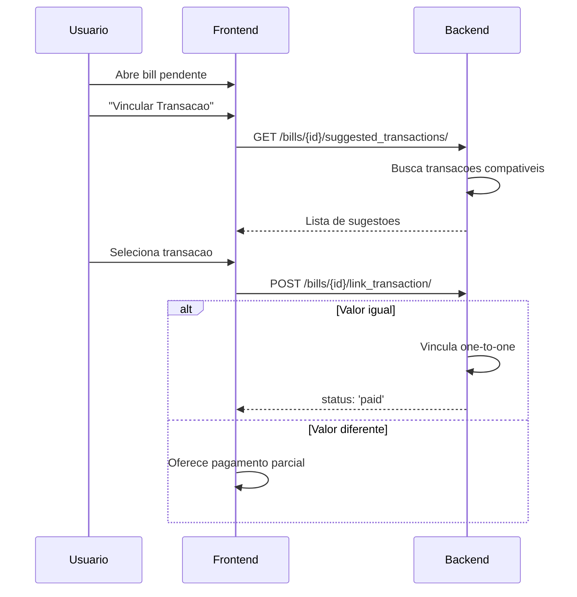
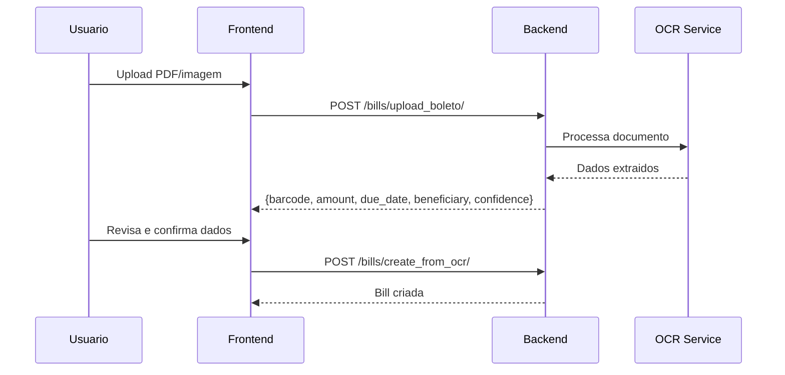

# Contas a Pagar e Receber (Bills)

## Proposito

Gerenciamento de contas a pagar (payable) e receber (receivable), com suporte a pagamentos parciais, recorrencia, vinculacao com transacoes e OCR de boletos.

---

## Componentes Principais

### Backend

| Componente | Arquivo | Responsabilidade |
|------------|---------|------------------|
| Bill Model | `backend/apps/banking/models.py:400` | Modelo de conta |
| BillPayment Model | `backend/apps/banking/models.py:500` | Pagamentos parciais |
| BillViewSet | `backend/apps/banking/views.py:800` | CRUD e operacoes |
| TransactionMatchService | `backend/apps/banking/services.py:300` | Vinculacao |
| OCRService | `backend/apps/banking/ocr_service.py` | OCR de boletos |

### Frontend

| Componente | Arquivo | Responsabilidade |
|------------|---------|------------------|
| Bills Page | `frontend/app/(dashboard)/bills/page.tsx` | Listagem principal |
| LinkBillDialog | `frontend/components/banking/LinkBillDialog.tsx` | Vincular transacao |
| LinkPartialPaymentDialog | `frontend/components/banking/LinkPartialPaymentDialog.tsx` | Pagamento parcial |
| BillPaymentsList | `frontend/components/banking/BillPaymentsList.tsx` | Lista de pagamentos |

---

## Fluxo do Usuario

### Criar Conta



### Registrar Pagamento



### Vincular Transacao



---

## Regras de Negocio

### Tipos de Bill

| Tipo | Descricao | Exemplo |
|------|-----------|---------|
| `payable` | Conta a pagar | Boletos, faturas, despesas |
| `receivable` | Conta a receber | Vendas, servicos prestados |

### Status

| Status | Condicao | Badge |
|--------|----------|-------|
| `pending` | amount_paid = 0 | Amarelo |
| `partially_paid` | 0 < amount_paid < amount | Azul |
| `paid` | amount_paid >= amount | Verde |
| `cancelled` | Cancelada manualmente | Cinza |

### Calculo de Status

```python
# backend/apps/banking/models.py
def update_status(self):
    if self.amount_paid >= self.amount:
        self.status = 'paid'
        self.paid_at = timezone.now()
    elif self.amount_paid > 0:
        self.status = 'partially_paid'
    else:
        self.status = 'pending'
    self.save()
```

### Recorrencia

| Tipo | Comportamento |
|------|---------------|
| `once` | Conta unica |
| `monthly` | Repete mensalmente |
| `weekly` | Repete semanalmente |
| `yearly` | Repete anualmente |

### Atraso (Overdue)

```python
# backend/apps/banking/models.py
@property
def is_overdue(self):
    if self.status == 'paid':
        return False
    return self.due_date < timezone.now().date()
```

---

## Estados Possiveis

### Pagina de Bills

| Estado | Condicao | UI |
|--------|----------|-----|
| Loading | Carregando | Skeleton |
| Vazio | Nenhuma bill | Empty state |
| Lista | Bills carregadas | Tabela com filtros |
| Filtrado | Filtros aplicados | Badge de filtro ativo |

### Card de Bill

| Estado | Visual |
|--------|--------|
| Pendente | Badge amarelo |
| Parcialmente Pago | Badge azul + progress bar |
| Pago | Badge verde |
| Atrasado | Badge vermelho + icone alerta |

### Dialog de Pagamento

| Estado | Condicao | UI |
|--------|----------|-----|
| Inicial | Valor sugerido = remaining | Input preenchido |
| Parcial | Valor < remaining | Aviso de pagamento parcial |
| Total | Valor = remaining | Botao "Pagar Total" |
| Erro | Valor > remaining | Input vermelho |

---

## Pagamentos Parciais

### Modelo BillPayment

```python
class BillPayment(models.Model):
    bill = models.ForeignKey(Bill, related_name='payments')
    amount = models.DecimalField()
    payment_date = models.DateField()
    notes = models.TextField(blank=True)
    transaction = models.OneToOneField(Transaction, null=True)
```

### Fluxo

1. Usuario adiciona pagamento parcial
2. BillPayment criado
3. Bill.amount_paid atualizado
4. Status recalculado (pending -> partially_paid -> paid)
5. Opcional: vincular a transacao existente

### Validacoes

```python
def clean(self):
    if self.amount > self.bill.amount_remaining:
        raise ValidationError('Valor maior que o restante')
```

---

## OCR de Boletos

### Fluxo



### Campos Extraidos

| Campo | Fonte | Confidence |
|-------|-------|------------|
| Codigo de barras | Linha digitavel FEBRABAN | Alta |
| Valor | Texto do boleto | Media |
| Data vencimento | Texto do boleto | Media |
| Beneficiario | Texto do boleto | Baixa |

### Campos no Model

```python
class Bill(models.Model):
    # ... campos normais ...

    # OCR Fields
    source_file = models.FileField(upload_to='boletos/', null=True)
    barcode = models.CharField(max_length=100, blank=True)
    ocr_confidence = models.IntegerField(null=True)  # 0-100
    ocr_raw_data = models.JSONField(null=True)
    created_from_ocr = models.BooleanField(default=False)
```

---

## Integracao com Outros Modulos

| Modulo | Integracao |
|--------|------------|
| Transactions | Vinculacao one-to-one ou parcial |
| Categories | Categoria opcional na bill |
| Reports | Cash flow projection |
| Dashboard | Cards de resumo |

---

## Sugestao de Transacoes

### Algoritmo

```python
# backend/apps/banking/services.py
def get_suggested_transactions_for_bill(bill):
    # Busca transacoes do mesmo tipo, nao vinculadas
    transactions = Transaction.objects.filter(
        account__connection__user=bill.user,
        type='CREDIT' if bill.type == 'receivable' else 'DEBIT',
        linked_bill__isnull=True
    )

    # Ordena por proximidade de valor e data
    scored = []
    for t in transactions:
        value_diff = abs(float(t.amount) - float(bill.amount))
        date_diff = abs((t.date.date() - bill.due_date).days)
        score = value_diff * 0.7 + date_diff * 0.3
        scored.append((t, score))

    return sorted(scored, key=lambda x: x[1])[:10]
```

---

## API de Bills

### Endpoints

| Metodo | Endpoint | Descricao |
|--------|----------|-----------|
| GET | `/bills/` | Listar (com filtros) |
| POST | `/bills/` | Criar |
| PATCH | `/bills/{id}/` | Atualizar |
| DELETE | `/bills/{id}/` | Deletar |
| POST | `/bills/{id}/add_payment/` | Adicionar pagamento |
| GET | `/bills/{id}/payments/` | Listar pagamentos |
| DELETE | `/bills/{id}/payments/{pid}/` | Remover pagamento |
| POST | `/bills/{id}/link_transaction/` | Vincular transacao |
| POST | `/bills/{id}/unlink_transaction/` | Desvincular |
| GET | `/bills/{id}/suggested_transactions/` | Sugestoes |
| GET | `/bills/summary/` | Resumo totais |
| GET | `/bills/cash_flow_projection/` | Projecao 12 meses |

### Filtros

| Parametro | Tipo | Descricao |
|-----------|------|-----------|
| type | string | payable, receivable |
| status | string | pending, partially_paid, paid |
| is_overdue | boolean | Apenas atrasadas |
| date_from | date | Vencimento a partir de |
| date_to | date | Vencimento ate |
| category | uuid | Por categoria |
