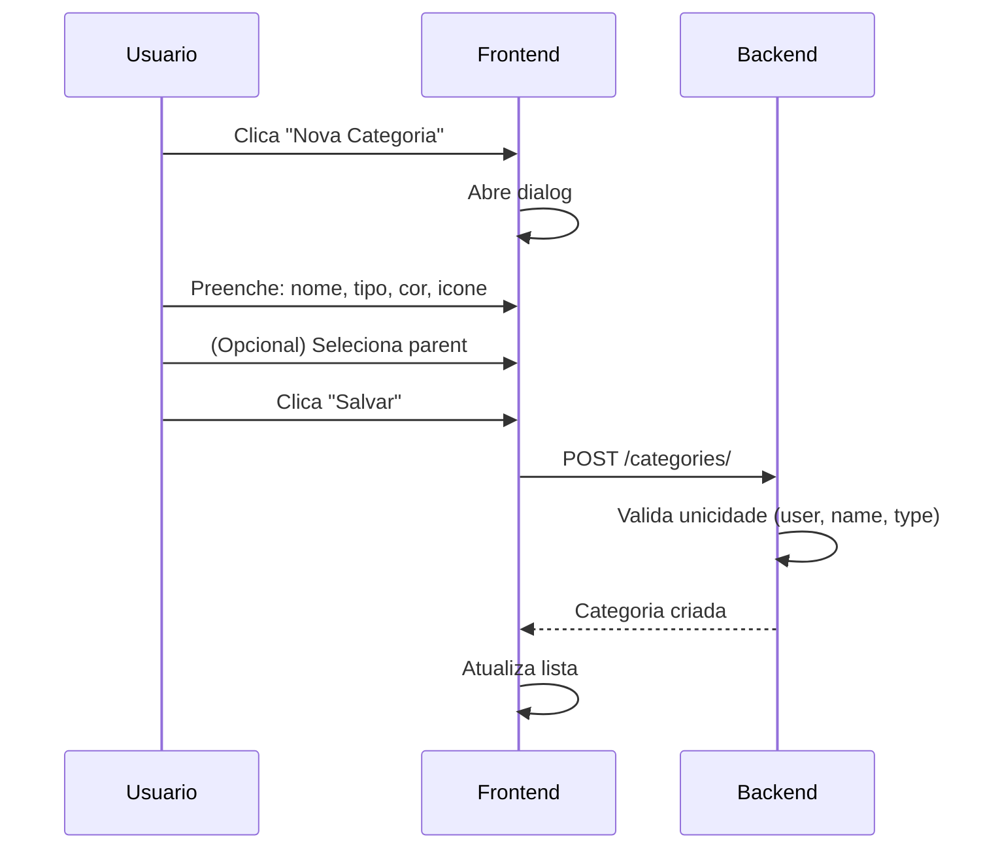
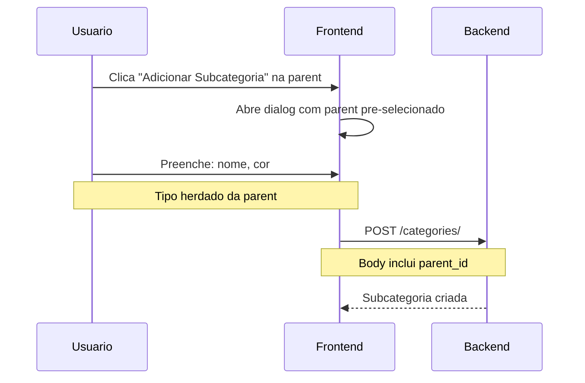

# Categorias

## Proposito

Gerenciamento de categorias e subcategorias customizaveis para organizacao de transacoes e contas. Permite aos usuarios criar taxonomias personalizadas para sua realidade financeira.

---

## Componentes Principais

### Backend

| Componente | Arquivo | Responsabilidade |
|------------|---------|------------------|
| Category Model | `backend/apps/banking/models.py:280` | Modelo de categoria |
| CategoryRule Model | `backend/apps/banking/models.py:340` | Regras automaticas |
| CategoryViewSet | `backend/apps/banking/views.py:600` | CRUD de categorias |
| CategoryRuleViewSet | `backend/apps/banking/views.py:700` | CRUD de regras |

### Frontend

| Componente | Arquivo | Responsabilidade |
|------------|---------|------------------|
| Categories Page | `frontend/app/(dashboard)/categories/page.tsx` | Listagem e CRUD |
| CategoryPopoverContent | `frontend/components/banking/CategoryPopoverContent.tsx` | Seletor inline |

---

## Fluxo do Usuario

### Criar Categoria



### Criar Subcategoria



---

## Regras de Negocio

### Estrutura de Categoria

```python
# backend/apps/banking/models.py
class Category(models.Model):
    user = models.ForeignKey(User, on_delete=models.CASCADE)
    name = models.CharField(max_length=100)
    type = models.CharField(choices=[('income', 'Receita'), ('expense', 'Despesa')])
    color = models.CharField(max_length=7)  # Hex color
    icon = models.CharField(max_length=10)  # Emoji
    is_system = models.BooleanField(default=False)
    parent = models.ForeignKey('self', null=True, related_name='subcategories')

    class Meta:
        unique_together = ['user', 'name', 'type']
```

### Hierarquia

```
Categoria (parent=null)
├── Subcategoria 1 (parent=Categoria)
├── Subcategoria 2 (parent=Categoria)
└── Subcategoria 3 (parent=Categoria)
```

- **Maximo 2 niveis**: Categoria -> Subcategoria
- **Tipo herdado**: Subcategoria herda tipo da parent
- **Icon herdado**: Subcategoria usa icon da parent na exibicao

### Categorias de Sistema

| Caracteristica | Valor |
|----------------|-------|
| `is_system` | `true` |
| Pode editar | Sim (nome, cor, icon) |
| Pode deletar | Nao |

### Cores Pre-definidas

```typescript
// frontend/app/(dashboard)/categories/page.tsx
const presetColors = [
  '#ef4444', '#f97316', '#f59e0b', '#eab308',
  '#84cc16', '#22c55e', '#10b981', '#14b8a6',
  '#06b6d4', '#0ea5e9', '#3b82f6', '#6366f1',
  '#8b5cf6', '#a855f7', '#d946ef', '#ec4899',
  // ... 24 cores total
];
```

### Icones Pre-definidos

```typescript
const presetIcons = [
  '🏠', '🚗', '🍔', '🛒', '💼', '💊',
  '🎓', '🎮', '✈️', '💰', '📱', '👕',
  // ... 24 icones total
];
```

---

## Estados Possiveis

### Pagina de Categorias

| Estado | Condicao | UI |
|--------|----------|-----|
| Loading | Carregando | Skeleton |
| Vazio | Nenhuma categoria | Empty state (raro) |
| Lista | Categorias carregadas | Cards por tipo |
| Dialog Aberto | Criando/editando | Modal form |
| Salvando | Request em andamento | Botao desabilitado |
| Deletando | Confirmacao | Alert dialog |

### Dialog de Categoria

| Estado | Condicao | UI |
|--------|----------|-----|
| Novo | editingCategory = null | Formulario vazio |
| Editando | editingCategory != null | Formulario preenchido |
| Subcategoria | parent selecionado | Tipo desabilitado |
| Validando | Campos incompletos | Erro no campo |

---

## Validacoes

### Criacao

| Campo | Regra |
|-------|-------|
| name | Obrigatorio, unico por (user, type) |
| type | income ou expense |
| color | Formato hex (#XXXXXX) |
| icon | Emoji valido |
| parent | Se informado, deve ser do mesmo type |

### Edicao

| Regra | Descricao |
|-------|-----------|
| Tipo imutavel | Nao pode mudar type apos criacao |
| System protected | Nao pode deletar is_system=true |

### Delecao

```python
# backend/apps/banking/views.py
def destroy(self, request, pk):
    category = self.get_object()
    if category.is_system:
        return Response({'error': 'Nao pode deletar categoria de sistema'}, 400)

    # Transacoes ficam sem categoria (null)
    Transaction.objects.filter(user_category=category).update(user_category=None)
    category.delete()
```

---

## Integracao com Outros Modulos

| Modulo | Integracao |
|--------|------------|
| Transactions | user_category, user_subcategory |
| Bills | category opcional |
| Reports | Breakdown por categoria |
| CategoryRules | Regras automaticas |

---

## Regras Automaticas (CategoryRules)

### Estrutura

```python
class CategoryRule(models.Model):
    user = models.ForeignKey(User)
    pattern = models.CharField(max_length=200)  # Texto normalizado
    match_type = models.CharField(choices=[
        ('prefix', 'Prefixo'),
        ('contains', 'Contem'),
        ('fuzzy', 'Aproximado')
    ])
    category = models.ForeignKey(Category)
    is_active = models.BooleanField(default=True)
    applied_count = models.IntegerField(default=0)
```

### Criacao Automatica

Quando usuario categoriza transacao e marca "Criar regra":

```python
# backend/apps/banking/services.py
def create_rule_from_transaction(user, transaction, category):
    pattern = normalize_text(transaction.description)
    rule, created = CategoryRule.objects.update_or_create(
        user=user,
        pattern=pattern,
        defaults={
            'category': category,
            'match_type': 'contains',
            'is_active': True
        }
    )
    return rule
```

### Aplicacao

Novas transacoes sao automaticamente categorizadas:

```python
def apply_rules_to_transaction(user, transaction):
    rules = CategoryRule.objects.filter(user=user, is_active=True)
    description = normalize_text(transaction.description)

    for rule in rules:
        if matches_rule(description, rule):
            transaction.user_category = rule.category
            transaction.save()
            rule.applied_count += 1
            rule.save()
            break
```

---

## API de Categorias

### Listagem

```
GET /api/banking/categories/
```

Retorna categorias pai com subcategorias nested:

```json
[
  {
    "id": "uuid",
    "name": "Alimentacao",
    "type": "expense",
    "color": "#ef4444",
    "icon": "🍔",
    "is_system": false,
    "subcategories": [
      {
        "id": "uuid",
        "name": "Restaurantes",
        "color": "#f97316"
      },
      {
        "id": "uuid",
        "name": "Supermercado",
        "color": "#84cc16"
      }
    ]
  }
]
```

### CRUD

| Metodo | Endpoint | Descricao |
|--------|----------|-----------|
| GET | `/categories/` | Listar todas |
| POST | `/categories/` | Criar |
| PATCH | `/categories/{id}/` | Atualizar |
| DELETE | `/categories/{id}/` | Deletar |

---

## Regras de Categorizacao Automatica

Regras permitem categorizar transacoes automaticamente com base em padroes de texto.

### Endpoints

| Metodo | Endpoint | Descricao |
|--------|----------|-----------|
| GET | `/category-rules/` | Listar regras |
| POST | `/category-rules/` | Criar regra |
| PATCH | `/category-rules/{id}/` | Editar regra |
| DELETE | `/category-rules/{id}/` | Excluir regra |
| POST | `/category-rules/{id}/apply/` | Aplicar a transacoes existentes |
| GET | `/category-rules/stats/` | Estatisticas |

### Tipos de Match

| Tipo | Descricao | Exemplo |
|------|-----------|---------|
| `prefix` | Descricao comeca com o padrao | "pix enviado" casa com "PIX ENVIADO PARA JOAO" |
| `contains` | Padrao aparece em qualquer lugar | "uber" casa com "PAGAMENTO UBER BRASIL" |
| `fuzzy` | Similaridade >= 70% | "restaurante" casa com "RESTAUTANTE SILVA" |

### Criar Regra com Aplicacao a Existentes

```bash
curl -X POST /api/banking/category-rules/ \
  -H "Authorization: Bearer $TOKEN" \
  -d '{
    "pattern": "pix enviado para paulo",
    "match_type": "contains",
    "category": "uuid-da-categoria",
    "apply_to_existing": true
  }'
```

**Resposta:**
```json
{
  "id": "uuid",
  "pattern": "pix enviado para paulo",
  "match_type": "contains",
  "category": "uuid",
  "category_name": "Pro-Labore",
  "is_active": true,
  "applied_count": 0,
  "apply_result": {
    "matched_count": 15,
    "updated_count": 12
  }
}
```

### Aplicar Regra Existente

```bash
curl -X POST /api/banking/category-rules/{id}/apply/ \
  -H "Authorization: Bearer $TOKEN"
```

**Resposta:**
```json
{
  "success": true,
  "matched_count": 15,
  "updated_count": 12,
  "message": "Regra aplicada: 15 transacoes correspondentes, 12 atualizadas"
}
```

### Como Testar

**1. Via UI (Configuracoes > Automacao):**
```
1. Acessar /settings
2. Clicar aba "Automacao"
3. Clicar "Nova Regra"
4. Preencher: padrao="uber", tipo="Contem", categoria="Transporte"
5. Marcar "Aplicar a transacoes existentes"
6. Clicar "Criar Regra"
7. Verificar toast com quantidade de transacoes atualizadas
```

**2. Via API (curl):**
```bash
# Criar regra
curl -X POST http://localhost:8000/api/banking/category-rules/ \
  -H "Authorization: Bearer $TOKEN" \
  -H "Content-Type: application/json" \
  -d '{"pattern": "teste", "match_type": "contains", "category": "UUID", "apply_to_existing": true}'

# Aplicar regra existente
curl -X POST http://localhost:8000/api/banking/category-rules/UUID/apply/ \
  -H "Authorization: Bearer $TOKEN"

# Listar regras
curl http://localhost:8000/api/banking/category-rules/ \
  -H "Authorization: Bearer $TOKEN"
```

**3. Via Django Shell:**
```python
from apps.banking.models import CategoryRule, Transaction
from apps.banking.services import CategoryRuleService

# Criar regra
rule = CategoryRule.objects.create(
    user=user,
    pattern="uber",
    match_type="contains",
    category=categoria,
    is_active=True
)

# Aplicar a existentes
result = CategoryRuleService.apply_rule_to_existing_transactions(rule)
print(f"Matched: {result['matched_count']}, Updated: {result['updated_count']}")

# Verificar transacoes atualizadas
Transaction.objects.filter(user_category=categoria).count()
```

### Fluxo de Execucao

```
1. Usuario cria/edita regra
2. Backend normaliza padrao (lowercase, sem acentos)
3. Se apply_to_existing=true:
   a. Busca todas transacoes do usuario
   b. Para cada transacao, testa match (prefix/contains/fuzzy)
   c. Se match, atualiza user_category
   d. Incrementa applied_count da regra
4. Retorna contagem de matched/updated
```

### Arquivos Relacionados

| Arquivo | Conteudo |
|---------|----------|
| `backend/apps/banking/models.py:585` | Modelo CategoryRule |
| `backend/apps/banking/services.py:1867` | apply_rule_to_existing_transactions |
| `backend/apps/banking/views.py:1812` | CategoryRuleViewSet |
| `frontend/app/(dashboard)/settings/page.tsx` | UI de gerenciamento |
| `frontend/services/banking.service.ts:469` | Metodos do frontend |
