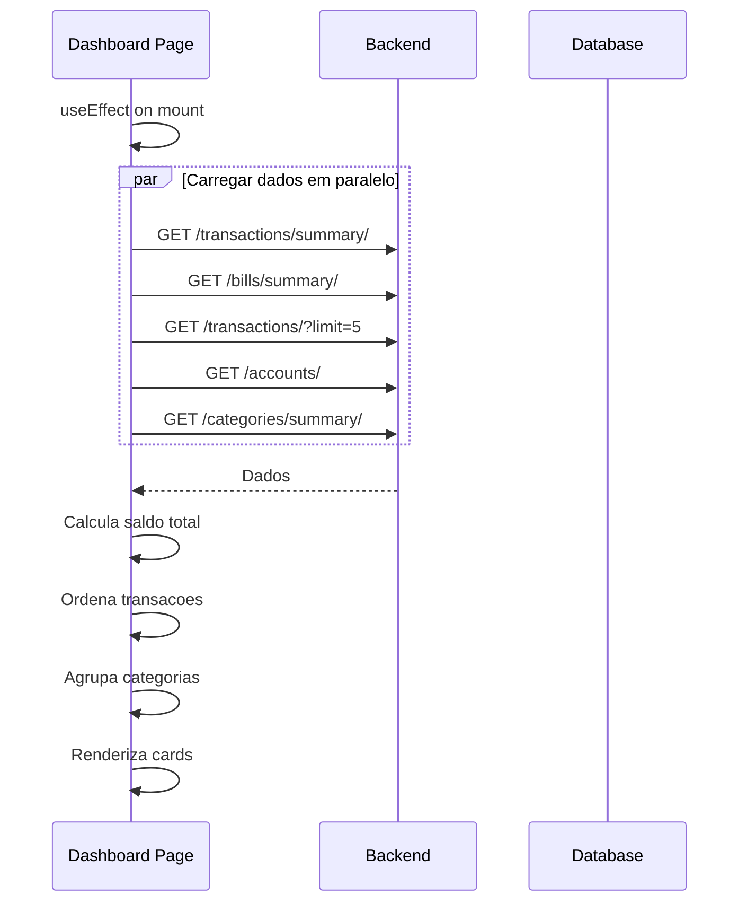

# Dashboard

## Proposito

Visao geral consolidada da saude financeira do usuario, exibindo saldos, receitas, despesas, contas a pagar/receber e transacoes recentes em uma unica tela.

---

## Componentes Principais

### Frontend

| Componente | Arquivo | Responsabilidade |
|------------|---------|------------------|
| Dashboard Page | `frontend/app/(dashboard)/dashboard/page.tsx` | Pagina principal |
| MainLayout | `frontend/components/layouts/MainLayout.tsx` | Layout com sidebar |

---

## Estrutura da Pagina

```
+------------------------------------------------------------------+
| Header: Bom dia, [Nome]!                                         |
+------------------------------------------------------------------+
|                                                                  |
| +----------------+ +----------------+ +----------------+ +------+|
| | SALDO TOTAL    | | RECEITAS       | | DESPESAS       | |RESULT||
| | R$ 45.000      | | R$ 70.000      | | R$ 25.000      | |+45k  ||
| +----------------+ +----------------+ +----------------+ +------+|
|                                                                  |
| +----------------+ +----------------+ +----------------+          |
| | A RECEBER      | | A PAGAR        | | ATRASADAS      |          |
| | R$ 15.000      | | R$ 8.000       | | R$ 2.000       |          |
| +----------------+ +----------------+ +----------------+          |
|                                                                  |
| +--------------------------------+ +----------------------------+|
| | TRANSACOES RECENTES            | | PRINCIPAIS CATEGORIAS      ||
| | - Supermercado    -R$ 350      | | Alimentacao    R$ 5.000    ||
| | - Salario         +R$ 8.000    | | Transporte     R$ 3.000    ||
| | - Aluguel         -R$ 2.500    | | Moradia        R$ 2.500    ||
| | - Cliente X       +R$ 5.000    | | Lazer          R$ 1.500    ||
| | - Luz             -R$ 180      | | Outros         R$ 1.000    ||
| +--------------------------------+ +----------------------------+|
|                                                                  |
| +----------------+ +----------------+ +----------------+          |
| | VER CONTAS     | | VER TRANSACOES | | VER RELATORIOS |          |
| +----------------+ +----------------+ +----------------+          |
|                                                                  |
+------------------------------------------------------------------+
```

---

## Fluxo de Dados



---

## Cards de Resumo

### Saldo Total

```typescript
// Calculo: soma de contas que NAO sao cartao de credito
const totalBalance = accounts
  .filter(acc => acc.type !== 'CREDIT_CARD')
  .reduce((sum, acc) => sum + parseFloat(acc.balance), 0);
```

| Campo | Fonte | Calculo |
|-------|-------|---------|
| Valor | accounts | Sum(balance) where type != CREDIT_CARD |
| Icone | - | Wallet |
| Cor | - | Azul |

### Receitas do Mes

| Campo | Fonte | Calculo |
|-------|-------|---------|
| Valor | summary.income | Transacoes CREDIT do mes |
| Icone | - | TrendingUp |
| Cor | - | Verde |

### Despesas do Mes

| Campo | Fonte | Calculo |
|-------|-------|---------|
| Valor | summary.expenses | abs(Transacoes DEBIT do mes) |
| Icone | - | TrendingDown |
| Cor | - | Vermelho |

### Resultado

| Campo | Fonte | Calculo |
|-------|-------|---------|
| Valor | - | income - expenses |
| Icone | - | Scale |
| Cor | - | Verde se positivo, vermelho se negativo |

---

## Cards de Bills

### Contas a Receber

```typescript
const totalReceivable = billsSummary.total_receivable_pending;
```

| Campo | Fonte |
|-------|-------|
| Valor | bills/summary → total_receivable_pending |
| Link | /bills?type=receivable |

### Contas a Pagar

| Campo | Fonte |
|-------|-------|
| Valor | bills/summary → total_payable_pending |
| Link | /bills?type=payable |

### Contas Atrasadas

| Campo | Fonte |
|-------|-------|
| Valor | bills/summary → total_overdue |
| Link | /bills?is_overdue=true |
| Destaque | Badge vermelho se > 0 |

---

## Transacoes Recentes

### Logica

```typescript
// Ultimas 5 transacoes ordenadas por data
const recentTransactions = transactions
  .sort((a, b) => new Date(b.date) - new Date(a.date))
  .slice(0, 5);
```

### Exibicao

| Campo | Formato |
|-------|---------|
| Descricao | Texto truncado |
| Valor | Formatado BRL, cor por tipo |
| Data | Relativa (hoje, ontem, DD/MM) |
| Categoria | Badge com cor |

---

## Principais Categorias

### Logica

```typescript
// Top 5 categorias por valor absoluto
const topCategories = Object.entries(categorySummary)
  .sort((a, b) => Math.abs(b[1]) - Math.abs(a[1]))
  .slice(0, 5);
```

### Exibicao

| Campo | Formato |
|-------|---------|
| Nome | Nome da categoria |
| Valor | Formatado BRL |
| Barra | Proporcional ao maior |

---

## Quick Actions

| Acao | Link | Icone |
|------|------|-------|
| Ver Contas | /accounts | CreditCard |
| Ver Transacoes | /transactions | ArrowUpDown |
| Ver Relatorios | /reports | BarChart |

---

## Estados Possiveis

| Estado | Condicao | UI |
|--------|----------|-----|
| Loading | Carregando dados | Skeleton completo |
| Vazio | Sem conexoes | Empty state com CTA |
| Parcial | Sem transacoes | Cards zerados |
| Completo | Dados carregados | Dashboard completo |

---

## Onboarding

### Tour de Primeira Vez

```typescript
// frontend/app/(dashboard)/dashboard/page.tsx
const { startTour, hasCompletedTour } = useOnboarding();
const tourStartedRef = useRef(false);

useEffect(() => {
  if (!hasCompletedTour && !tourStartedRef.current) {
    tourStartedRef.current = true;
    startTour();
  }
}, [hasCompletedTour]);
```

### Steps do Tour

1. Bem-vindo ao CaixaHub
2. Aqui voce ve seu saldo total
3. Estas sao suas receitas e despesas
4. Acompanhe suas contas a pagar
5. Veja suas transacoes recentes
6. Acesse relatorios detalhados

---

## Saudacao Dinamica

```typescript
const getGreeting = () => {
  const hour = new Date().getHours();
  if (hour < 12) return 'Bom dia';
  if (hour < 18) return 'Boa tarde';
  return 'Boa noite';
};

// "Bom dia, Joao!"
const greeting = `${getGreeting()}, ${user.first_name}!`;
```

---

## Responsividade

### Desktop (> 1024px)

```
[Card][Card][Card][Card]
[Card][Card][Card]
[Transacoes     ][Categorias    ]
[Action][Action][Action]
```

### Tablet (768px - 1024px)

```
[Card][Card]
[Card][Card]
[Card][Card][Card]
[Transacoes]
[Categorias]
[Action][Action][Action]
```

### Mobile (< 768px)

```
[Card]
[Card]
[Card]
[Card]
[Card]
[Card]
[Card]
[Transacoes]
[Categorias]
[Action]
[Action]
[Action]
```

---

## Integracao com Outros Modulos

| Modulo | Dados Exibidos |
|--------|----------------|
| Banking | Saldo, transacoes |
| Bills | Resumo a pagar/receber |
| Categories | Top categorias |
| Auth | Nome do usuario |

---

## Performance

### Otimizacoes

| Tecnica | Aplicacao |
|---------|-----------|
| Promise.all | Chamadas paralelas |
| limit=5 | Transacoes limitadas |
| Cache | React Query (se usado) |
| Skeleton | Loading states |

### Chamadas API

```typescript
useEffect(() => {
  const loadData = async () => {
    setLoading(true);
    try {
      const [summary, bills, transactions, accounts, categories] = await Promise.all([
        bankingService.getFinancialSummary(),
        billsService.getSummary(),
        bankingService.getTransactions({ limit: 5 }),
        bankingService.getAccounts(),
        bankingService.getCategorySummary()
      ]);
      // setState...
    } finally {
      setLoading(false);
    }
  };
  loadData();
}, []);
```
