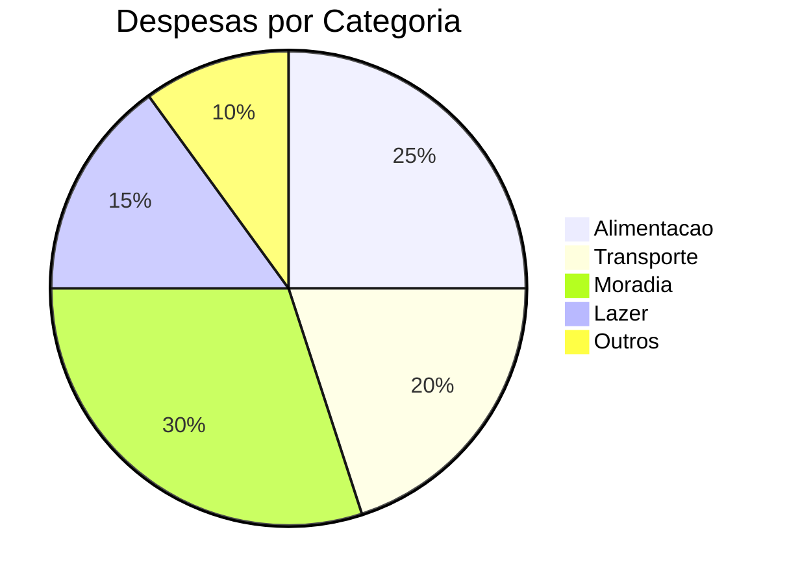
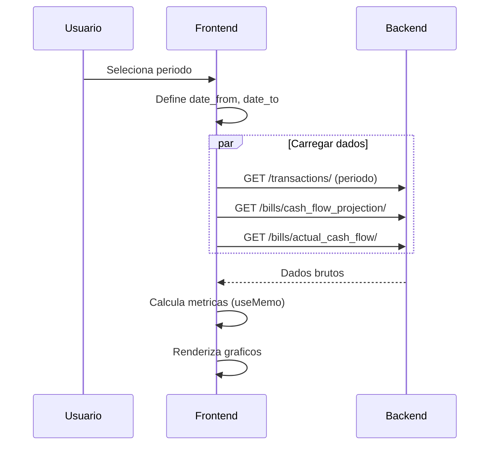
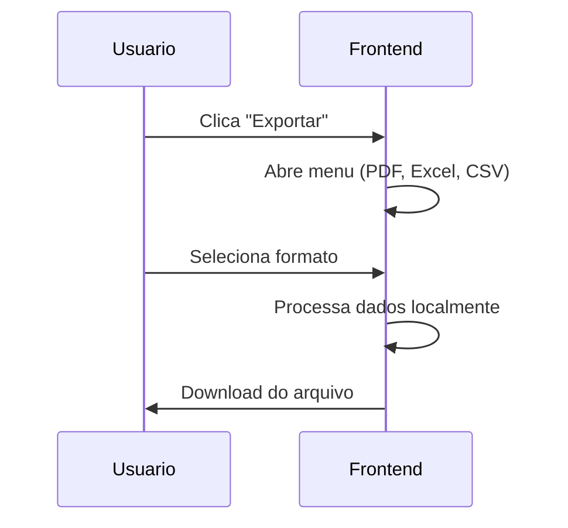

# Relatorios

## Proposito

Geracao de relatorios financeiros incluindo DRE (Demonstrativo de Resultado), fluxo de caixa, analise por categoria e comparativos entre periodos.

---

## Componentes Principais

### Backend

| Componente | Arquivo | Responsabilidade |
|------------|---------|------------------|
| ReportsViewSet | `backend/apps/reports/views.py` | Endpoints de relatorios |
| ReportsService | `backend/apps/reports/services.py` | Logica de geracao |

### Frontend

| Componente | Arquivo | Responsabilidade |
|------------|---------|------------------|
| Reports Page | `frontend/app/(dashboard)/reports/page.tsx` | Dashboard de relatorios |
| DRE Page | `frontend/app/(dashboard)/reports/dre/page.tsx` | DRE detalhado |
| Chart Components | `frontend/components/charts/` | Graficos |

---

## Tipos de Relatorio

### 1. DRE (Demonstrativo de Resultado)

**Proposito**: Visao consolidada de receitas e despesas por periodo.

```
RECEITAS OPERACIONAIS
  (+) Vendas                    R$ 50.000,00
  (+) Servicos                  R$ 20.000,00
  = Total Receitas              R$ 70.000,00

DESPESAS OPERACIONAIS
  (-) Custos Operacionais       R$ 15.000,00
  (-) Despesas Administrativas  R$ 10.000,00
  (-) Marketing                 R$  5.000,00
  = Total Despesas              R$ 30.000,00

RESULTADO
  = Resultado Operacional       R$ 40.000,00
  = Margem (%)                  57,14%
```

### 2. Fluxo de Caixa

**Proposito**: Entradas e saidas ao longo do tempo.

| Periodo | Entradas | Saidas | Saldo |
|---------|----------|--------|-------|
| Jan/24 | 50.000 | 30.000 | +20.000 |
| Fev/24 | 45.000 | 35.000 | +10.000 |
| ... | ... | ... | ... |

### 3. Breakdown por Categoria

**Proposito**: Distribuicao de gastos/receitas por categoria.



### 4. Analise Comparativa

**Proposito**: Comparar dois periodos.

| Metrica | Periodo 1 | Periodo 2 | Variacao |
|---------|-----------|-----------|----------|
| Receitas | 50.000 | 55.000 | +10% |
| Despesas | 30.000 | 28.000 | -7% |
| Resultado | 20.000 | 27.000 | +35% |

---

## Fluxo do Usuario

### Gerar Relatorio



### Exportar Relatorio



---

## Periodos Pre-definidos

| Periodo | Descricao |
|---------|-----------|
| Todas | Sem filtro de data |
| Mes Atual | Primeiro dia do mes ate hoje |
| Ultimos 3 Meses | 3 meses anteriores |
| Ultimos 6 Meses | 6 meses anteriores |
| Ano Atual | 1/Jan ate hoje |
| Ano Anterior | 1/Jan a 31/Dez do ano passado |
| Personalizado | Date picker customizado |

---

## Calculos

### Metricas Principais

```typescript
// frontend/app/(dashboard)/reports/page.tsx
const income = transactions
  .filter(t => t.type === 'CREDIT')
  .reduce((sum, t) => sum + Math.abs(parseFloat(t.amount)), 0);

const expenses = transactions
  .filter(t => t.type === 'DEBIT')
  .reduce((sum, t) => sum + Math.abs(parseFloat(t.amount)), 0);

const balance = income - expenses;
const savingsRate = income > 0 ? (balance / income) * 100 : 0;
```

### Breakdown por Categoria

```typescript
const categoryData = useMemo(() => {
  const grouped = {};
  transactions.forEach(t => {
    const category = t.effective_category || 'Sem categoria';
    if (!grouped[category]) grouped[category] = 0;
    grouped[category] += Math.abs(parseFloat(t.amount));
  });

  return Object.entries(grouped)
    .sort((a, b) => b[1] - a[1])
    .slice(0, 8); // Top 8
}, [transactions]);
```

### Dados Mensais

```typescript
const monthlyData = useMemo(() => {
  const grouped = {};
  transactions.forEach(t => {
    const month = format(new Date(t.date), 'yyyy-MM');
    if (!grouped[month]) {
      grouped[month] = { income: 0, expenses: 0 };
    }
    if (t.type === 'CREDIT') {
      grouped[month].income += Math.abs(parseFloat(t.amount));
    } else {
      grouped[month].expenses += Math.abs(parseFloat(t.amount));
    }
  });

  return Object.entries(grouped)
    .map(([month, data]) => ({
      month,
      ...data,
      balance: data.income - data.expenses
    }))
    .slice(-12); // Ultimos 12 meses
}, [transactions]);
```

### Saldo Diario Acumulado

```typescript
const dailyBalance = useMemo(() => {
  let cumulative = 0;
  return transactions
    .sort((a, b) => new Date(a.date) - new Date(b.date))
    .map(t => {
      const amount = parseFloat(t.amount);
      cumulative += t.type === 'CREDIT' ? amount : -amount;
      return { date: t.date, balance: cumulative };
    });
}, [transactions]);
```

---

## Graficos

### Componentes Recharts

| Grafico | Tipo | Dados |
|---------|------|-------|
| Receitas vs Despesas | ComposedChart | monthlyData |
| Evolucao do Saldo | LineChart | dailyBalance |
| Distribuicao | PieChart | categoryData |
| Fluxo de Caixa | BarChart | cashFlowProjection |

### Exemplo: Grafico Composto

```tsx
<ComposedChart data={monthlyData}>
  <XAxis dataKey="month" />
  <YAxis />
  <Bar dataKey="income" fill="#22c55e" name="Receitas" />
  <Bar dataKey="expenses" fill="#ef4444" name="Despesas" />
  <Line dataKey="balance" stroke="#3b82f6" name="Resultado" />
  <Tooltip formatter={formatCurrency} />
  <Legend />
</ComposedChart>
```

---

## Estados Possiveis

### Pagina de Relatorios

| Estado | Condicao | UI |
|--------|----------|-----|
| Loading | Carregando dados | Skeleton |
| Vazio | Sem transacoes | Empty state |
| Com Dados | Transacoes carregadas | Tabs com graficos |
| Exportando | Gerando arquivo | Spinner no botao |

### Tabs

| Tab | Conteudo |
|-----|----------|
| Visao Geral | Cards de resumo + graficos principais |
| Categorias | Pizza + Top 5 |
| Fluxo de Caixa | Projecao vs Realizado |
| Comparativo | Tabela de comparacao |

---

## Exportacao

### Formatos

| Formato | Biblioteca | Secoes |
|---------|------------|--------|
| PDF | jsPDF + autoTable | Resumo, tabelas |
| Excel | xlsx | Multiplas abas |
| CSV | Nativo | Dados tabulares |

### Estrutura do PDF

```
RELATORIO FINANCEIRO - CaixaHub
Periodo: 01/01/2024 a 31/12/2024
Gerado em: 18/12/2025

RESUMO
+-------------+---------------+
| Receitas    | R$ 70.000,00  |
| Despesas    | R$ 30.000,00  |
| Resultado   | R$ 40.000,00  |
| Taxa Poup.  | 57,14%        |
+-------------+---------------+

DETALHAMENTO POR CATEGORIA
+---------------+---------------+--------+
| Categoria     | Valor         | %      |
+---------------+---------------+--------+
| Alimentacao   | R$ 10.000,00  | 33,3%  |
| Transporte    | R$ 8.000,00   | 26,7%  |
| ...           | ...           | ...    |
+---------------+---------------+--------+
```

### Implementacao Excel

```typescript
// frontend/app/(dashboard)/reports/page.tsx
const exportToExcel = () => {
  const workbook = XLSX.utils.book_new();

  // Aba Resumo
  const summaryData = [
    ['Metrica', 'Valor'],
    ['Receitas', income],
    ['Despesas', expenses],
    ['Resultado', balance],
  ];
  const summarySheet = XLSX.utils.aoa_to_sheet(summaryData);
  XLSX.utils.book_append_sheet(workbook, summarySheet, 'Resumo');

  // Aba Categorias
  const categorySheet = XLSX.utils.json_to_sheet(categoryData);
  XLSX.utils.book_append_sheet(workbook, categorySheet, 'Categorias');

  // Aba Mensal
  const monthlySheet = XLSX.utils.json_to_sheet(monthlyData);
  XLSX.utils.book_append_sheet(workbook, monthlySheet, 'Mensal');

  XLSX.writeFile(workbook, `relatorio_${period}.xlsx`);
};
```

---

## Integracao com Outros Modulos

| Modulo | Integracao |
|--------|------------|
| Transactions | Dados de entrada |
| Bills | Cash flow projection |
| Categories | Agrupamento |
| Dashboard | Resumo simplificado |

---

## API de Relatorios

### Endpoints

| Metodo | Endpoint | Descricao |
|--------|----------|-----------|
| GET | `/reports/dre/` | DRE completo |
| GET | `/reports/dre_export_pdf/` | Exportar DRE PDF |
| GET | `/reports/dre_export_excel/` | Exportar DRE Excel |
| GET | `/reports/cash_flow/` | Fluxo de caixa |
| GET | `/reports/category_breakdown/` | Por categoria |
| GET | `/reports/monthly_summary/` | Resumo mensal |
| GET | `/reports/trend_analysis/` | Tendencias |
| POST | `/reports/comparison/` | Comparativo |

### Parametros Comuns

| Parametro | Tipo | Descricao |
|-----------|------|-----------|
| start_date | date | Inicio do periodo |
| end_date | date | Fim do periodo |
| granularity | string | daily, weekly, monthly, yearly |
| compare_with_previous | boolean | Incluir periodo anterior |
