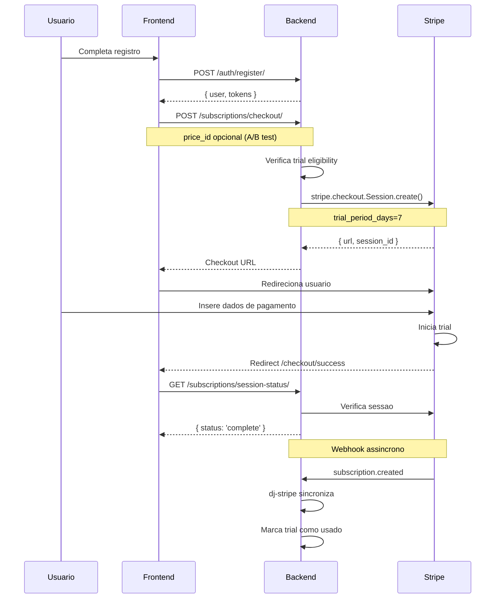
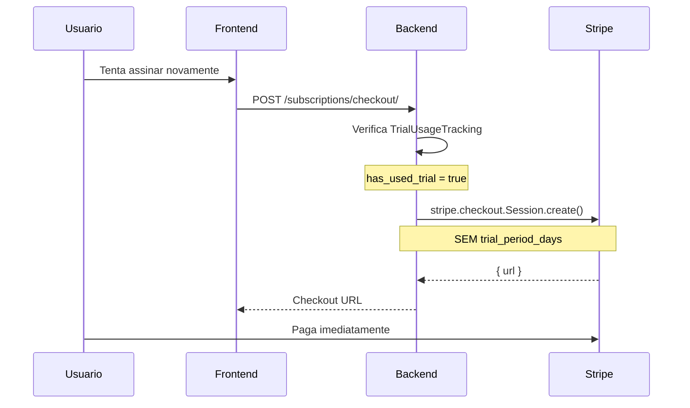

# Assinaturas (Subscriptions)

## Proposito

Gerenciamento de assinaturas e pagamentos do CaixaHub atraves do Stripe, incluindo trial de 7 dias, checkout, portal do cliente e verificacao de status.

---

## Componentes Principais

### Backend

| Componente | Arquivo | Responsabilidade |
|------------|---------|------------------|
| TrialUsageTracking Model | `backend/apps/subscriptions/models.py` | Rastreia uso de trial |
| Views | `backend/apps/subscriptions/views.py` | Endpoints |
| Services | `backend/apps/subscriptions/services.py` | Helpers Stripe |

### Frontend

| Componente | Arquivo | Responsabilidade |
|------------|---------|------------------|
| Checkout Success | `frontend/app/checkout/success/page.tsx` | Pos-checkout |
| Checkout Cancel | `frontend/app/checkout/cancel/page.tsx` | Checkout cancelado |
| Subscription Expired | `frontend/app/subscription/expired/page.tsx` | Assinatura expirada |
| Trial Used | `frontend/app/subscription/trial-used/page.tsx` | Trial ja usado |
| SubscriptionManagement | `frontend/components/subscription/SubscriptionManagement.tsx` | Gerenciamento |
| SubscriptionGuard | `frontend/components/guards/SubscriptionGuard.tsx` | Protecao de rotas |

---

## Fluxo do Usuario

### Novo Usuario (Com Trial)



### Usuario Retornando (Sem Trial)



---

## Regras de Negocio

### Trial

| Regra | Valor |
|-------|-------|
| Duracao | 7 dias |
| Elegibilidade | 1 trial por usuario (lifetime) |
| Verificacao | TrialUsageTracking.has_used_trial |

```python
# backend/apps/subscriptions/views.py
def create_checkout_session(user, price_id):
    trial_tracking, _ = TrialUsageTracking.objects.get_or_create(user=user)

    session_params = {
        'customer': get_or_create_customer(user),
        'mode': 'subscription',
        'line_items': [{'price': price_id, 'quantity': 1}],
        'success_url': f'{FRONTEND_URL}/checkout/success?session_id={{CHECKOUT_SESSION_ID}}',
        'cancel_url': f'{FRONTEND_URL}/checkout/cancel',
    }

    if not trial_tracking.has_used_trial:
        session_params['subscription_data'] = {'trial_period_days': 7}

    return stripe.checkout.Session.create(**session_params)
```

### Status de Assinatura

| Status | Descricao | Acesso |
|--------|-----------|--------|
| `trialing` | Em periodo de trial | Completo |
| `active` | Assinatura ativa | Completo |
| `past_due` | Pagamento atrasado | Limitado (grace period) |
| `canceled` | Cancelada | Bloqueado |
| `none` | Sem assinatura | Bloqueado |

### Verificacao de Acesso

```typescript
// frontend/app/(dashboard)/layout.tsx
const checkSubscription = async () => {
  const status = await subscriptionService.getStatus();

  if (status.status === 'none' || status.status === 'canceled') {
    // Redireciona para checkout
    await startStripeCheckout();
  }
};
```

---

## Integracao Stripe

### Biblioteca

**dj-stripe**: Sincronizacao automatica de webhooks

### Modelos Sincronizados

| Modelo Stripe | Modelo Django |
|---------------|---------------|
| Customer | djstripe.Customer |
| Subscription | djstripe.Subscription |
| PaymentMethod | djstripe.PaymentMethod |
| Invoice | djstripe.Invoice |

### Webhooks Automaticos

| Evento | Acao |
|--------|------|
| `checkout.session.completed` | Cria subscription |
| `customer.subscription.updated` | Atualiza status |
| `customer.subscription.deleted` | Marca cancelada |
| `invoice.payment_failed` | Atualiza para past_due |

### Customer Portal

```python
# backend/apps/subscriptions/services.py
def create_customer_portal_session(user, return_url):
    customer = get_or_create_customer(user)
    session = stripe.billing_portal.Session.create(
        customer=customer.id,
        return_url=return_url
    )
    return session.url
```

---

## Estados Possiveis

### Verificacao de Subscription

| Estado | Condicao | Acao |
|--------|----------|------|
| Carregando | Verificando status | Spinner |
| Ativo | trialing ou active | Libera acesso |
| Expirado | past_due, canceled, none | Redireciona |

### Pagina de Settings

| Estado | UI |
|--------|-----|
| Trialing | Badge "Trial" + dias restantes |
| Active | Badge "Ativo" + data renovacao |
| Past Due | Alerta + botao atualizar pagamento |

### Checkout Flow

| Pagina | Condicao |
|--------|----------|
| /checkout/success | Pagamento OK |
| /checkout/cancel | Usuario cancelou |
| /subscription/expired | Assinatura expirou |
| /subscription/trial-used | Tentou trial novamente |

---

## A/B Testing de Precos

### Fluxo

1. Landing page define `signup_price_id`
2. Usuario registra (salva no User)
3. Checkout usa price_id do registro ou default

```python
# backend/apps/subscriptions/views.py
def checkout(request):
    price_id = request.data.get('price_id') or request.user.signup_price_id
    if not price_id:
        price_id = settings.STRIPE_DEFAULT_PRICE_ID

    session = create_checkout_session(request.user, price_id)
    return Response({'url': session.url})
```

### Tracking

```python
# backend/apps/authentication/models.py
class User(AbstractUser):
    signup_price_id = models.CharField(max_length=100, blank=True)
    acquisition_angle = models.CharField(max_length=50, blank=True)
```

---

## Componentes Frontend

### SubscriptionGuard

```tsx
// frontend/components/guards/SubscriptionGuard.tsx
export function SubscriptionGuard({ children }) {
  const [status, setStatus] = useState<SubscriptionStatus | null>(null);

  useEffect(() => {
    subscriptionService.getStatus().then(setStatus);
  }, []);

  if (!status) return <Loading />;

  if (status.status === 'none' || status.status === 'canceled') {
    return <RedirectToCheckout />;
  }

  return children;
}
```

### SubscriptionManagement

```tsx
// frontend/components/subscription/SubscriptionManagement.tsx
export function SubscriptionManagement() {
  const { status, subscription } = useSubscription();

  return (
    <Card>
      <CardHeader>Sua Assinatura</CardHeader>
      <CardContent>
        <Badge>{getStatusLabel(status)}</Badge>

        {status === 'trialing' && (
          <p>Trial termina em {formatDate(subscription.trial_end)}</p>
        )}

        {status === 'active' && (
          <p>Renova em {formatDate(subscription.current_period_end)}</p>
        )}

        <Button onClick={openCustomerPortal}>
          Gerenciar Assinatura
        </Button>
      </CardContent>
    </Card>
  );
}
```

---

## Integracao com Outros Modulos

| Modulo | Integracao |
|--------|------------|
| Auth | Checkout apos registro |
| Dashboard | Verificacao de acesso |
| AI Insights | Requer assinatura ativa |

---

## API de Subscriptions

### Endpoints

| Metodo | Endpoint | Auth | Descricao |
|--------|----------|------|-----------|
| POST | `/subscriptions/checkout/` | Sim | Criar checkout session |
| GET | `/subscriptions/status/` | Sim | Status atual |
| POST | `/subscriptions/portal/` | Sim | Abrir customer portal |
| GET | `/subscriptions/config/` | Sim | Stripe publishable key |
| GET | `/subscriptions/session-status/` | Nao | Verificar session |

### Payload Checkout

```json
POST /subscriptions/checkout/
{
  "price_id": "price_xxxxx"  // Opcional
}
```

### Response Status

```json
GET /subscriptions/status/
{
  "status": "active",
  "subscription_id": "sub_xxxxx",
  "current_period_end": "2025-01-18T00:00:00Z",
  "cancel_at_period_end": false
}
```

---

## Variaveis de Ambiente

```bash
# Stripe
STRIPE_TEST_PUBLIC_KEY=pk_test_xxxxx
STRIPE_TEST_SECRET_KEY=sk_test_xxxxx
STRIPE_LIVE_PUBLIC_KEY=pk_live_xxxxx  # Producao
STRIPE_LIVE_SECRET_KEY=sk_live_xxxxx  # Producao
STRIPE_LIVE_MODE=false
STRIPE_DEFAULT_PRICE_ID=price_xxxxx
DJSTRIPE_WEBHOOK_SECRET=whsec_xxxxx
```
