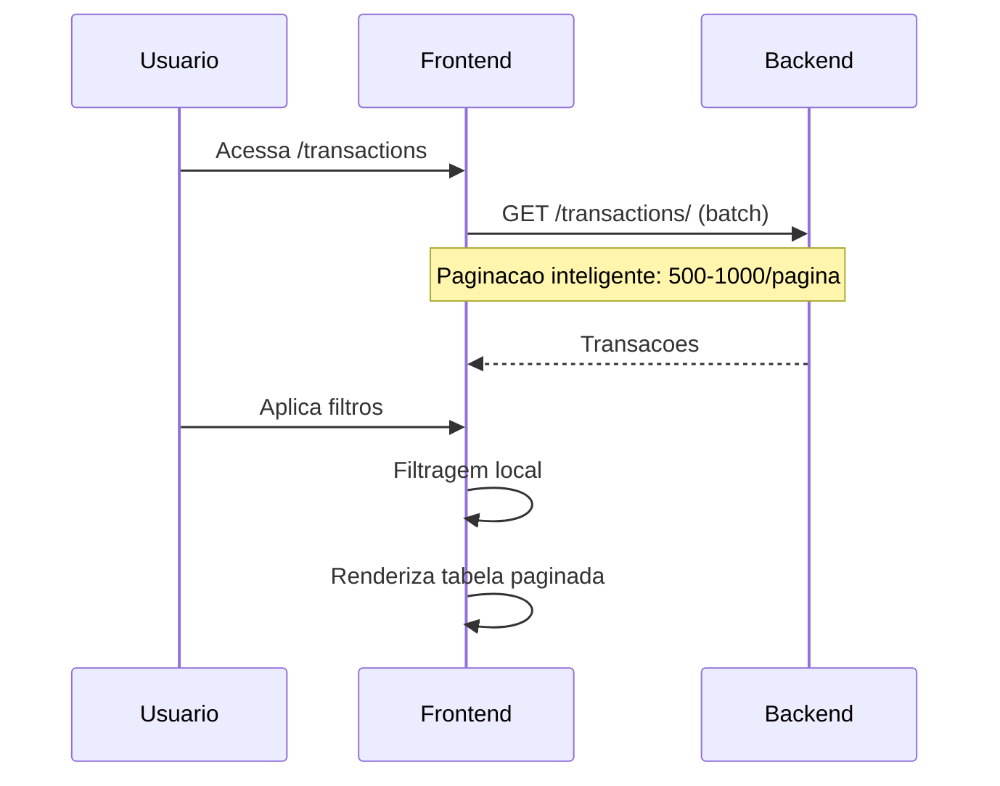
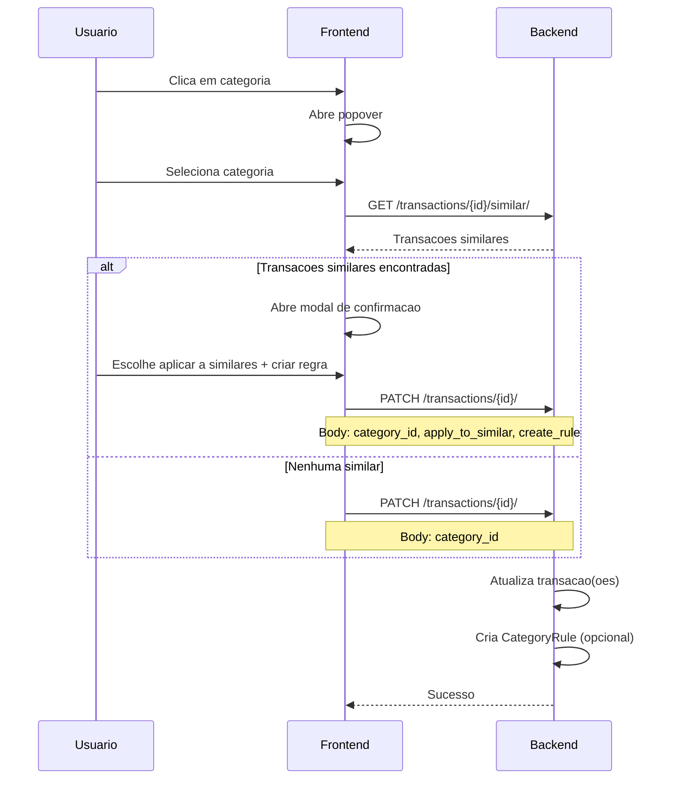

# Transacoes

## Proposito

Listagem, visualizacao e categorizacao de transacoes bancarias sincronizadas, com suporte a regras automaticas de categorizacao e vinculacao com contas a pagar/receber.

---

## Componentes Principais

### Backend

| Componente | Arquivo | Responsabilidade |
|------------|---------|------------------|
| Transaction Model | `backend/apps/banking/models.py:200` | Modelo de transacao |
| Category Model | `backend/apps/banking/models.py:280` | Categorias customizaveis |
| CategoryRule Model | `backend/apps/banking/models.py:340` | Regras automaticas |
| TransactionViewSet | `backend/apps/banking/views.py:400` | Endpoints |
| TransactionService | `backend/apps/banking/services.py:200` | Sincronizacao |

### Frontend

| Componente | Arquivo | Responsabilidade |
|------------|---------|------------------|
| Transactions Page | `frontend/app/(dashboard)/transactions/page.tsx` | Listagem principal |
| TransactionsList | `frontend/components/banking/transactions-list.tsx` | Componente de lista |
| CategoryPopoverContent | `frontend/components/banking/CategoryPopoverContent.tsx` | Seletor de categoria |
| CategoryConfirmModal | `frontend/components/banking/CategoryConfirmModal.tsx` | Confirmacao batch |

---

## Fluxo do Usuario

### Visualizar Transacoes



### Categorizar Transacao



---

## Regras de Negocio

### Tipos de Transacao

| Tipo | Descricao | Exibicao |
|------|-----------|----------|
| `CREDIT` | Entrada de dinheiro | Verde, sinal + |
| `DEBIT` | Saida de dinheiro | Vermelho, sinal - |

### Hierarquia de Categoria

```
Categoria Efetiva = user_category || pluggy_category
```

1. **user_category**: Categoria definida pelo usuario (prioritaria)
2. **pluggy_category**: Categoria sugerida pelo Pluggy (fallback)

### Subcategorias

```python
# backend/apps/banking/models.py
class Category(models.Model):
    parent = models.ForeignKey('self', null=True, related_name='subcategories')
```

Transacao pode ter:
- `user_category_id`: Categoria pai
- `user_subcategory_id`: Subcategoria (opcional)

### Regras de Categorizacao Automatica

| Campo | Descricao |
|-------|-----------|
| pattern | Texto normalizado (sem acentos, lowercase) |
| match_type | `prefix`, `contains`, `fuzzy` |
| category | FK para Category |
| applied_count | Contador de aplicacoes |

```python
# backend/apps/banking/services.py
def normalize_text(text: str) -> str:
    return unidecode(text.lower().strip())

def apply_rule(transaction, rule):
    normalized = normalize_text(transaction.description)
    if rule.match_type == 'prefix':
        return normalized.startswith(rule.pattern)
    elif rule.match_type == 'contains':
        return rule.pattern in normalized
```

---

## Filtros Disponiveis

| Filtro | Tipo | Aplicacao |
|--------|------|-----------|
| Busca | Texto | description, category, merchant_name |
| Conta | Select | account_id |
| Tipo | Select | CREDIT, DEBIT |
| Categoria | Select | user_category_id |
| Data Inicio | Date | date >= |
| Data Fim | Date | date <= |

### Filtragem Local

```typescript
// frontend/app/(dashboard)/transactions/page.tsx
const filteredTransactions = useMemo(() => {
  return transactions.filter(t => {
    if (searchTerm && !matchesSearch(t, searchTerm)) return false;
    if (selectedAccount && t.account_id !== selectedAccount) return false;
    if (selectedType && t.type !== selectedType) return false;
    if (selectedCategory && t.user_category_id !== selectedCategory) return false;
    if (startDate && new Date(t.date) < startDate) return false;
    if (endDate && new Date(t.date) > endDate) return false;
    return true;
  });
}, [transactions, filters]);
```

---

## Estados Possiveis

### Pagina de Transacoes

| Estado | Condicao | UI |
|--------|----------|-----|
| Loading | Carregando dados | Skeleton table |
| Vazio | Nenhuma transacao | Empty state |
| Lista | Transacoes carregadas | Tabela paginada |
| Filtrado | Filtros aplicados | Tabela + badges de filtro |
| Atualizando | Salvando categoria | Spinner na celula |

### Modal de Categorizacao

| Estado | Condicao | UI |
|--------|----------|-----|
| Buscando | Procurando similares | Spinner |
| Com Similares | X transacoes encontradas | Checkbox "aplicar a X similares" |
| Sem Similares | Nenhuma similar | Apenas botao confirmar |
| Salvando | Request em andamento | Botao desabilitado |

---

## Paginacao

### Frontend (Local)

```typescript
const ITEMS_PER_PAGE = 50;
const currentPageData = filteredTransactions.slice(
  (currentPage - 1) * ITEMS_PER_PAGE,
  currentPage * ITEMS_PER_PAGE
);
```

### Backend (API)

```python
# Paginacao inteligente no service
if limit:
    return api.get('/transactions/', params={'limit': limit})
else:
    # Batch de 500-1000 por pagina, ate 20 paginas
    all_transactions = []
    page = 1
    while page <= 20:
        data = api.get('/transactions/', params={'page': page, 'page_size': 500})
        all_transactions.extend(data['results'])
        if not data['next']:
            break
        page += 1
    return all_transactions
```

---

## Exportacao

### Formatos Suportados

| Formato | Biblioteca | Detalhes |
|---------|------------|----------|
| CSV | Nativo | UTF-8 BOM, delimitador ; |
| Excel | xlsx | Formatacao de colunas |

### Campos Exportados

| Campo | Formato |
|-------|---------|
| Data | DD/MM/YYYY |
| Descricao | Texto |
| Valor | Numero (2 decimais) |
| Tipo | Receita/Despesa |
| Categoria | Nome |
| Conta | Nome |

---

## Integracao com Outros Modulos

| Modulo | Integracao |
|--------|------------|
| Bills | Vinculacao transacao <-> conta |
| Categories | Categorizacao |
| Reports | Dados para relatorios |
| Dashboard | Transacoes recentes |
| AI Insights | Base para analise |

---

## Vinculacao com Bills

### One-to-One (Full Payment)

```typescript
// Transacao paga bill integralmente
await bankingService.linkBill(transactionId, billId);
// Bill.status -> 'paid'
// Bill.linked_transaction -> transaction
```

### Partial Payment

```typescript
// Transacao e pagamento parcial
await billsService.addPayment(billId, {
  amount: partialAmount,
  transaction_id: transactionId
});
// Bill.status -> 'partially_paid'
// BillPayment criado com referencia
```
